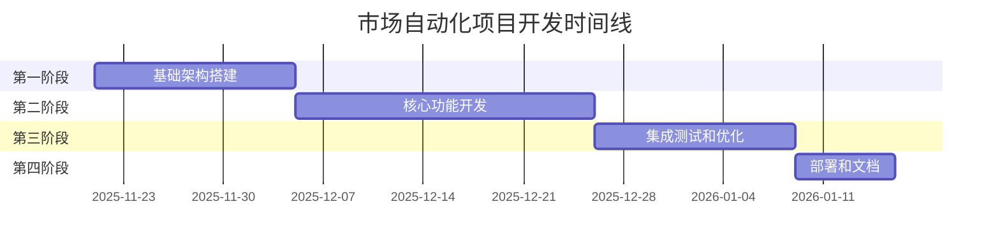

# 市场自动化项目开发路线图

## 文档信息

- **文档版本**: 1.0
- **创建日期**: 2025-11-21
- **最后更新**: 2025-11-21
- **文档状态**: 初稿
- **作者**: AI架构师

---

## 项目概述

### 背景和目标

市场自动化项目将从现有的三层架构（Python + Frida + Lua）转换为新的两层架构（Python + ADB/按键精灵 + 图像识别）。这一转换旨在：

- 提高系统稳定性和可靠性
- 降低技术复杂度和维护成本
- 增强反检测能力
- 优化数据处理流程
- 提高开发和维护效率

### 项目范围

- 重新设计自动化控制架构
- 实现截图和图像识别功能
- 开发本地数据存储系统
- 迁移现有配置和日志系统
- 保持与现有系统的数据兼容性

---

## 项目总体时间线

### 整体项目时间规划（10周）

### 关键里程碑设置

| 里程碑 | 时间点 | 关键成果 |
|--------|--------|----------|
| M1: 基础架构完成 | 第2周末 | 新项目结构、ADB控制模块、截图管理模块 |
| M2: 核心功能完成 | 第5周末 | 图像识别模块、操作模拟模块、基本自动化流程 |
| M3: 系统测试完成 | 第7周末 | 完整集成系统、测试报告、性能优化 |
| M4: 系统正式上线 | 第8周末 | 生产环境系统、监控系统、用户培训 |

### 各阶段时间分配

| 阶段 | 持续时间 | 工作量占比 | 风险系数 |
|------|----------|------------|----------|
| 第一阶段：基础架构搭建 | 2周 | 20% | 低 |
| 第二阶段：核心功能开发 | 3周 | 30% | 高 |
| 第三阶段：集成测试和优化 | 2周 | 25% | 中 |
| 第四阶段：部署和文档 | 1周 | 15% | 低 |
| 缓冲时间 | 2周 | 10% | - |

### 风险缓冲时间安排

- **技术风险缓冲**: 1周（分配给第二阶段）
- **集成风险缓冲**: 0.5周（分配给第三阶段）
- **部署风险缓冲**: 0.5周（分配给第四阶段）

---

## 详细开发阶段规划

### 第一阶段：基础架构搭建（2周）

#### 阶段目标
建立新系统的基础框架，实现基本的设备控制和截图功能。

#### 详细任务分解

##### 任务1.1：环境准备和依赖安装（3天）
- **任务描述**:
  - 设置新的开发环境
  - 安装和配置ADB工具
  - 安装图像处理相关依赖（OpenCV、Tesseract等）
  - 配置Python虚拟环境

- **技术要求**:
  - Python 3.8+
  - ADB工具配置
  - OpenCV 4.5+
  - Tesseract OCR
  - Pillow图像处理库

- **输入输出**:
  - 输入：现有项目环境
  - 输出：配置完成的开发环境

- **依赖关系**: 无

- **时间估算**:
  - 最佳情况：2天
  - 最可能时间：3天
  - 最坏情况：4天
  - 风险系数：低

- **人员分配**:
  - 负责人：Python开发工程师
  - 参与人员：DevOps工程师
  - 技能要求：Python开发、环境配置
  - 工作量估算：24人时

- **验收标准**:
  - 功能验收标准：所有依赖正确安装和配置
  - 性能验收标准：环境启动时间 < 2分钟
  - 质量验收标准：通过环境测试脚本
  - 测试通过标准：所有依赖测试通过

##### 任务1.2：现有代码清理和重构（4天）
- **任务描述**:
  - 分析现有代码结构
  - 移除Frida和Lua相关代码
  - 重构配置管理系统
  - 保留可复用的工具模块

- **技术要求**:
  - 代码重构技能
  - 配置系统设计
  - 模块化设计

- **输入输出**:
  - 输入：现有项目代码
  - 输出：清理后的基础代码框架

- **依赖关系**: 任务1.1

- **时间估算**:
  - 最佳情况：3天
  - 最可能时间：4天
  - 最坏情况：5天
  - 风险系数：中

- **人员分配**:
  - 负责人：Python开发工程师
  - 参与人员：架构师
  - 技能要求：Python开发、代码重构
  - 工作量估算：32人时

- **验收标准**:
  - 功能验收标准：移除所有Frida/Lua相关代码
  - 性能验收标准：代码启动正常
  - 质量验收标准：代码符合PEP8规范
  - 测试通过标准：基础功能测试通过

##### 任务1.3：新模块框架搭建（4天）
- **任务描述**:
  - 创建新的模块结构
  - 实现基础类和接口
  - 建立模块间通信机制
  - 设计配置文件结构

- **技术要求**:
  - 面向对象设计
  - 接口设计
  - 模块化架构

- **输入输出**:
  - 输入：清理后的代码框架
  - 输出：新模块框架

- **依赖关系**: 任务1.2

- **时间估算**:
  - 最佳情况：3天
  - 最可能时间：4天
  - 最坏情况：6天
  - 风险系数：中

- **人员分配**:
  - 负责人：架构师
  - 参与人员：Python开发工程师
  - 技能要求：系统设计、Python开发
  - 工作量估算：32人时

- **验收标准**:
  - 功能验收标准：所有基础类和接口实现完成
  - 性能验收标准：模块加载时间 < 1秒
  - 质量验收标准：代码结构清晰，文档完整
  - 测试通过标准：单元测试覆盖率 > 70%

##### 任务1.4：基础配置扩展（3天）
- **任务描述**:
  - 扩展现有配置系统
  - 添加新架构相关配置项
  - 实现配置验证机制
  - 创建配置迁移工具

- **技术要求**:
  - 配置管理
  - 数据验证
  - 迁移工具开发

- **输入输出**:
  - 输入：现有配置文件
  - 输出：扩展后的配置系统

- **依赖关系**: 任务1.3

- **时间估算**:
  - 最佳情况：2天
  - 最可能时间：3天
  - 最坏情况：4天
  - 风险系数：低

- **人员分配**:
  - 负责人：Python开发工程师
  - 参与人员：无
  - 技能要求：配置管理、Python开发
  - 工作量估算：24人时

- **验收标准**:
  - 功能验收标准：所有配置项正确加载和验证
  - 性能验收标准：配置加载时间 < 500ms
  - 质量验收标准：配置验证覆盖所有场景
  - 测试通过标准：配置测试用例全部通过

---

### 第二阶段：核心功能开发（3周）

#### 阶段目标
实现核心自动化功能，包括截图管理、图像识别、操作模拟和数据处理。

#### 详细任务分解

##### 任务2.1：截图管理模块开发（5天）
- **任务描述**:
  - 实现ADB截图功能
  - 开发截图缓存机制
  - 实现截图压缩和优化
  - 创建截图版本管理

- **技术要求**:
  - ADB命令执行
  - 图像处理
  - 缓存算法
  - 文件管理

- **输入输出**:
  - 输入：设备连接
  - 输出：截图数据和管理系统

- **依赖关系**: 任务1.4

- **时间估算**:
  - 最佳情况：4天
  - 最可能时间：5天
  - 最坏情况：7天
  - 风险系数：中

- **人员分配**:
  - 负责人：Python开发工程师
  - 参与人员：图像算法工程师
  - 技能要求：ADB操作、图像处理、Python开发
  - 工作量估算：40人时

- **验收标准**:
  - 功能验收标准：能够稳定获取设备截图
  - 性能验收标准：截图获取时间 < 2秒
  - 质量验收标准：截图清晰度满足识别要求
  - 测试通过标准：截图功能测试用例全部通过

##### 任务2.2：ADB自动化控制模块开发（6天）
- **任务描述**:
  - 实现ADB命令执行器
  - 开发操作模拟功能（点击、滑动等）
  - 实现反检测机制
  - 创建操作序列管理

- **技术要求**:
  - ADB命令封装
  - 操作模拟算法
  - 反检测技术
  - 序列管理

- **输入输出**:
  - 输入：操作指令
  - 输出：设备操作执行结果

- **依赖关系**: 任务2.1

- **时间估算**:
  - 最佳情况：5天
  - 最可能时间：6天
  - 最坏情况：8天
  - 风险系数：高

- **人员分配**:
  - 负责人：Python开发工程师
  - 参与人员：自动化测试工程师
  - 技能要求：ADB操作、自动化控制、Python开发
  - 工作量估算：48人时

- **验收标准**:
  - 功能验收标准：所有基本操作正常执行
  - 性能验收标准：操作响应时间 < 1秒
  - 质量验收标准：操作成功率 > 95%
  - 测试通过标准：自动化操作测试用例全部通过

##### 任务2.3：图像识别模块开发（7天）
- **任务描述**:
  - 集成OCR引擎
  - 实现模板匹配功能
  - 开发坐标定位算法
  - 创建图像预处理流程

- **技术要求**:
  - OCR技术
  - 模板匹配算法
  - 坐标定位
  - 图像预处理

- **输入输出**:
  - 输入：截图数据
  - 输出：识别结果和坐标信息

- **依赖关系**: 任务2.1

- **时间估算**:
  - 最佳情况：6天
  - 最可能时间：7天
  - 最坏情况：10天
  - 风险系数：高

- **人员分配**:
  - 负责人：图像算法工程师
  - 参与人员：Python开发工程师
  - 技能要求：图像处理、OCR技术、算法开发
  - 工作量估算：56人时

- **验收标准**:
  - 功能验收标准：能够识别界面元素和文本
  - 性能验收标准：识别准确率 > 85%
  - 质量验收标准：识别速度 < 3秒
  - 测试通过标准：图像识别测试用例全部通过

##### 任务2.4：数据处理模块开发（5天）
- **任务描述**:
  - 实现数据提取和验证
  - 开发本地数据库存储
  - 创建统计分析功能
  - 实现数据导出功能

- **技术要求**:
  - 数据处理
  - 数据库设计
  - 统计分析
  - 数据导出

- **输入输出**:
  - 输入：识别结果数据
  - 输出：结构化数据和统计报告

- **依赖关系**: 任务2.3

- **时间估算**:
  - 最佳情况：4天
  - 最可能时间：5天
  - 最坏情况：7天
  - 风险系数：中

- **人员分配**:
  - 负责人：Python开发工程师
  - 参与人员：数据分析师
  - 技能要求：数据处理、数据库、Python开发
  - 工作量估算：40人时

- **验收标准**:
  - 功能验收标准：数据正确提取和存储
  - 性能验收标准：数据处理时间 < 1秒
  - 质量验收标准：数据完整性验证通过
  - 测试通过标准：数据处理测试用例全部通过

---

### 第三阶段：集成测试和优化（2周）

#### 阶段目标
确保系统稳定可靠，性能达标，满足生产环境要求。

#### 详细任务分解

##### 任务3.1：模块集成测试（4天）
- **任务描述**:
  - 集成所有开发模块
  - 执行端到端测试
  - 验证模块间通信
  - 修复集成问题

- **技术要求**:
  - 集成测试
  - 端到端测试
  - 模块通信
  - 问题诊断

- **输入输出**:
  - 输入：各模块代码
  - 输出：集成测试报告

- **依赖关系**: 任务2.4

- **时间估算**:
  - 最佳情况：3天
  - 最可能时间：4天
  - 最坏情况：6天
  - 风险系数：中

- **人员分配**:
  - 负责人：测试工程师
  - 参与人员：Python开发工程师、图像算法工程师
  - 技能要求：测试设计、问题诊断、系统集成
  - 工作量估算：32人时

- **验收标准**:
  - 功能验收标准：所有功能正常集成
  - 性能验收标准：端到端流程时间 < 10秒
  - 质量验收标准：集成测试覆盖率 > 80%
  - 测试通过标准：所有集成测试用例通过

##### 任务3.2：性能优化（4天）
- **任务描述**:
  - 分析性能瓶颈
  - 优化图像处理算法
  - 优化数据存储和查询
  - 优化内存使用

- **技术要求**:
  - 性能分析
  - 算法优化
  - 数据库优化
  - 内存管理

- **输入输出**:
  - 输入：性能分析报告
  - 输出：优化后的系统

- **依赖关系**: 任务3.1

- **时间估算**:
  - 最佳情况：3天
  - 最可能时间：4天
  - 最坏情况：6天
  - 风险系数：中

- **人员分配**:
  - 负责人：Python开发工程师
  - 参与人员：图像算法工程师、性能工程师
  - 技能要求：性能优化、算法调优、系统调优
  - 工作量估算：32人时

- **验收标准**:
  - 功能验收标准：功能不受优化影响
  - 性能验收标准：关键指标提升 > 20%
  - 质量验收标准：无性能回归
  - 测试通过标准：性能测试全部通过

##### 任务3.3：稳定性测试（3天）
- **任务描述**:
  - 执行长时间运行测试
  - 测试异常情况处理
  - 验证错误恢复机制
  - 测试资源泄漏

- **技术要求**:
  - 稳定性测试
  - 异常处理
  - 错误恢复
  - 资源管理

- **输入输出**:
  - 输入：优化后的系统
  - 输出：稳定性测试报告

- **依赖关系**: 任务3.2

- **时间估算**:
  - 最佳情况：2天
  - 最可能时间：3天
  - 最坏情况：4天
  - 风险系数：低

- **人员分配**:
  - 负责人：测试工程师
  - 参与人员：Python开发工程师
  - 技能要求：稳定性测试、问题诊断
  - 工作量估算：24人时

- **验收标准**:
  - 功能验收标准：长时间运行无异常
  - 性能验收标准：24小时运行无崩溃
  - 质量验收标准：错误恢复成功率 > 90%
  - 测试通过标准：稳定性测试用例全部通过

##### 任务3.4：错误处理完善（3天）
- **任务描述**:
  - 完善异常处理机制
  - 增强错误日志记录
  - 实现自动恢复功能
  - 创建错误处理文档

- **技术要求**:
  - 异常处理
  - 日志系统
  - 自动恢复
  - 文档编写

- **输入输出**:
  - 输入：稳定性测试结果
  - 输出：完善的错误处理系统

- **依赖关系**: 任务3.3

- **时间估算**:
  - 最佳情况：2天
  - 最可能时间：3天
  - 最坏情况：4天
  - 风险系数：低

- **人员分配**:
  - 负责人：Python开发工程师
  - 参与人员：技术文档工程师
  - 技能要求：异常处理、日志系统、文档编写
  - 工作量估算：24人时

- **验收标准**:
  - 功能验收标准：所有异常情况都有处理
  - 性能验收标准：错误处理不影响系统性能
  - 质量验收标准：错误日志完整详细
  - 测试通过标准：错误处理测试用例全部通过

---

### 第四阶段：部署和文档（1周）

#### 阶段目标
完成生产环境部署，编写完整文档，进行用户培训。

#### 详细任务分解

##### 任务4.1：生产环境部署（2天）
- **任务描述**:
  - 准备生产环境
  - 部署应用程序
  - 配置监控系统
  - 验证部署结果

- **技术要求**:
  - 环境部署
  - 系统配置
  - 监控设置
  - 部署验证

- **输入输出**:
  - 输入：测试通过的系统
  - 输出：生产环境系统

- **依赖关系**: 任务3.4

- **时间估算**:
  - 最佳情况：1天
  - 最可能时间：2天
  - 最坏情况：3天
  - 风险系数：低

- **人员分配**:
  - 负责人：DevOps工程师
  - 参与人员：Python开发工程师
  - 技能要求：系统部署、环境配置、监控设置
  - 工作量估算：16人时

- **验收标准**:
  - 功能验收标准：系统在生产环境正常运行
  - 性能验收标准：部署时间 < 30分钟
  - 质量验收标准：监控系统正常工作
  - 测试通过标准：部署验证测试全部通过

##### 任务4.2：用户文档编写（2天）
- **任务描述**:
  - 编写用户操作手册
  - 创建API文档
  - 编写故障排除指南
  - 制作快速入门指南

- **技术要求**:
  - 技术写作
  - 文档设计
  - 用户指南
  - API文档

- **输入输出**:
  - 输入：系统功能规格
  - 输出：完整的用户文档

- **依赖关系**: 任务4.1

- **时间估算**:
  - 最佳情况：1.5天
  - 最可能时间：2天
  - 最坏情况：3天
  - 风险系数：低

- **人员分配**:
  - 负责人：技术文档工程师
  - 参与人员：Python开发工程师
  - 技能要求：技术写作、文档设计
  - 工作量估算：16人时

- **验收标准**:
  - 功能验收标准：文档覆盖所有功能
  - 性能验收标准：文档易于理解和使用
  - 质量验收标准：文档格式规范统一
  - 测试通过标准：文档审查通过

##### 任务4.3：培训材料准备（1天）
- **任务描述**:
  - 准备培训PPT
  - 制作演示视频
  - 创建练习环境
  - 编写培训大纲

- **技术要求**:
  - 培训设计
  - 演示制作
  - 环境搭建
  - 教学设计

- **输入输出**:
  - 输入：用户文档
  - 输出：培训材料包

- **依赖关系**: 任务4.2

- **时间估算**:
  - 最佳情况：0.5天
  - 最可能时间：1天
  - 最坏情况：1.5天
  - 风险系数：低

- **人员分配**:
  - 负责人：产品经理
  - 参与人员：技术文档工程师
  - 技能要求：培训设计、演示制作
  - 工作量估算：8人时

- **验收标准**:
  - 功能验收标准：培训材料覆盖所有要点
  - 性能验收标准：培训时间控制在2小时内
  - 质量验收标准：培训材料易于理解
  - 测试通过标准：培训材料审查通过

##### 任务4.4：上线准备（2天）
- **任务描述**:
  - 最终系统验证
  - 性能基准测试
  - 安全检查
  - 上线计划确认

- **技术要求**:
  - 系统验证
  - 性能测试
  - 安全检查
  - 上线规划

- **输入输出**:
  - 输入：准备好的系统和文档
  - 输出：上线就绪的系统

- **依赖关系**: 任务4.3

- **时间估算**:
  - 最佳情况：1天
  - 最可能时间：2天
  - 最坏情况：3天
  - 风险系数：低

- **人员分配**:
  - 负责人：项目经理
  - 参与人员：Python开发工程师、测试工程师
  - 技能要求：系统验证、性能测试、安全检查
  - 工作量估算：16人时

- **验收标准**:
  - 功能验收标准：所有功能正常工作
  - 性能验收标准：满足性能指标要求
  - 质量验收标准：通过安全检查
  - 测试通过标准：上线检查清单全部通过

---

## 资源分配计划

### 人员角色和职责分配

| 角色 | 人数 | 技能要求 | 参与阶段 | 主要职责 |
|------|------|---------|---------|---------|
| 项目经理 | 1 | 项目管理经验 | 全程 | 项目协调、进度管理、风险控制 |
| Python开发工程师 | 2 | Python、ADB、图像处理 | 全程 | 核心功能开发、系统集成 |
| 图像算法工程师 | 1 | OpenCV、OCR、机器学习 | 阶段2-3 | 图像识别算法开发、优化 |
| 测试工程师 | 1 | 自动化测试、性能测试 | 阶段3-4 | 测试用例设计、执行、报告 |
| 技术文档工程师 | 1 | 技术写作能力 | 阶段3-4 | 文档编写、维护、用户指南 |
| DevOps工程师 | 1 | 系统部署、监控 | 阶段1、4 | 环境搭建、部署、监控 |

### 各阶段资源需求

#### 第一阶段：基础架构搭建
- **人员需求**: 5人（项目经理、2名Python开发工程师、图像算法工程师、DevOps工程师）
- **设备需求**: 开发环境、测试设备
- **时间投入**: 80人时

#### 第二阶段：核心功能开发
- **人员需求**: 5人（项目经理、2名Python开发工程师、图像算法工程师、测试工程师）
- **设备需求**: 多台测试设备、高性能开发机
- **时间投入**: 120人时

#### 第三阶段：集成测试和优化
- **人员需求**: 4人（项目经理、Python开发工程师、图像算法工程师、测试工程师）
- **设备需求**: 测试环境、性能测试工具
- **时间投入**: 80人时

#### 第四阶段：部署和文档
- **人员需求**: 5人（项目经理、Python开发工程师、测试工程师、技术文档工程师、DevOps工程师）
- **设备需求**: 生产环境、文档工具
- **时间投入**: 56人时

### 关键技能要求

#### 技术技能
- **Python开发**: 熟练掌握Python编程，熟悉面向对象设计
- **ADB操作**: 熟悉Android调试桥，能够执行各种设备操作
- **图像处理**: 掌握OpenCV、PIL等图像处理库
- **OCR技术**: 熟悉Tesseract、PaddleOCR等OCR引擎
- **数据库设计**: 熟悉SQLite数据库设计和优化

#### 软技能
- **项目管理**: 具备项目规划和执行能力
- **问题解决**: 能够快速定位和解决技术问题
- **团队协作**: 良好的沟通和协作能力
- **文档编写**: 能够编写清晰的技术文档

### 外部资源需求

#### 硬件资源
- **测试设备**: 3-5台不同品牌的Android设备
- **开发机器**: 2台高性能开发机（16GB内存，SSD硬盘）
- **服务器**: 1台用于部署和监控的服务器

#### 软件资源
- **开发工具**: PyCharm、Visual Studio Code
- **测试工具**: pytest、性能测试工具
- **文档工具**: Markdown编辑器、图表工具
- **监控工具**: 系统监控、日志分析工具

---

## 风险管理计划

### 各阶段风险识别

#### 第一阶段风险
| 风险项 | 风险等级 | 影响描述 | 应对措施 | 负责人 |
|-------|---------|---------|---------|--------|
| 环境配置问题 | 中 | 延迟开发进度 | 提前准备环境，使用容器化 | DevOps工程师 |
| 依赖安装失败 | 中 | 功能无法实现 | 准备多种安装方案 | Python开发工程师 |
| 代码重构困难 | 低 | 影响后续开发 | 逐步重构，保留备份 | Python开发工程师 |

#### 第二阶段风险
| 风险项 | 风险等级 | 影响描述 | 应对措施 | 负责人 |
|-------|---------|---------|---------|--------|
| 图像识别准确率不足 | 高 | 导致数据采集错误 | 多种识别算法结合，持续优化模板 | 图像算法工程师 |
| ADB连接不稳定 | 中 | 影响自动化流程稳定性 | 实现连接重试机制，监控连接状态 | Python开发工程师 |
| 操作模拟失败 | 中 | 自动化流程中断 | 实现多重验证，增强错误处理 | Python开发工程师 |
| 性能瓶颈 | 中 | 影响处理效率 | 优化算法，增加并发处理 | Python开发工程师 |

#### 第三阶段风险
| 风险项 | 风险等级 | 影响描述 | 应对措施 | 负责人 |
|-------|---------|---------|---------|--------|
| 模块集成问题 | 中 | 系统功能异常 | 提前设计接口，充分测试 | 测试工程师 |
| 性能不达标 | 中 | 影响用户体验 | 优化关键路径，使用缓存 | Python开发工程师 |
| 稳定性问题 | 中 | 系统崩溃 | 增强异常处理，实现自动恢复 | Python开发工程师 |

#### 第四阶段风险
| 风险项 | 风险等级 | 影响描述 | 应对措施 | 负责人 |
|-------|---------|---------|---------|--------|
| 部署失败 | 低 | 延迟上线 | 准备回滚方案，多次演练 | DevOps工程师 |
| 文档不完整 | 低 | 影响用户使用 | 提前编写，多次评审 | 技术文档工程师 |
| 用户培训效果差 | 低 | 影响推广 | 准备多种培训材料 | 产品经理 |

### 风险应对措施

#### 技术风险应对
1. **图像识别准确率不足**
   - 备选方案：使用多种OCR引擎，实现投票机制
   - 应急措施：降低自动化程度，增加人工验证
   - 预防措施：提前收集大量样本进行训练

2. **ADB连接不稳定**
   - 备选方案：实现设备连接池，支持多设备切换
   - 应急措施：增加重试机制，实现自动重连
   - 预防措施：使用高质量USB线，稳定网络环境

3. **性能瓶颈**
   - 备选方案：使用GPU加速，优化算法
   - 应急措施：降低处理频率，优化缓存策略
   - 预防措施：提前进行性能测试，识别瓶颈

#### 项目风险应对
1. **进度延期**
   - 备选方案：增加资源投入，调整优先级
   - 应急措施：缩减功能范围，分阶段交付
   - 预防措施：定期检查进度，及时调整计划

2. **人员流失**
   - 备选方案：交叉培训，知识文档化
   - 应急措施：快速招聘，临时调配资源
   - 预防措施：提供良好工作环境，激励机制

### 应急预案

#### 技术应急预案
1. **图像识别失败**
   - 立即切换到备用OCR引擎
   - 启用人工验证模式
   - 记录失败案例，用于后续优化

2. **设备连接中断**
   - 自动尝试重新连接
   - 切换到备用设备
   - 发送告警通知

3. **系统崩溃**
   - 自动重启服务
   - 从最近检查点恢复
   - 记录崩溃日志，分析原因

#### 项目应急预案
1. **关键人员离职**
   - 立即启动知识转移流程
   - 重新分配工作任务
   - 启动招聘流程

2. **需求变更**
   - 评估变更影响
   - 调整项目计划
   - 与相关方协商确认

### 风险监控机制

#### 监控指标
- **技术指标**: 识别准确率、系统响应时间、错误率
- **进度指标**: 任务完成率、里程碑达成情况
- **质量指标**: 测试覆盖率、缺陷密度

#### 监控频率
- **日常监控**: 每日检查技术指标
- **周度监控**: 每周检查进度指标
- **阶段监控**: 每阶段结束检查质量指标

#### 告警机制
- **技术告警**: 关键技术指标异常时立即告警
- **进度告警**: 进度偏差超过10%时告警
- **质量告警**: 质量指标不达标时告警

---

## 质量保证计划

### 代码审查流程

#### 审查标准
1. **代码规范**: 遵循PEP 8编码规范
2. **设计原则**: 遵循SOLID设计原则
3. **性能要求**: 满足性能指标要求
4. **安全要求**: 通过安全检查
5. **测试要求**: 单元测试覆盖率 > 80%

#### 审查流程
1. **开发者提交**: 开发者完成代码后提交审查
2. **同行审查**: 至少一名同行进行代码审查
3. **架构审查**: 关键模块需要架构师审查
4. **测试验证**: 通过所有测试用例
5. **合并代码**: 审查通过后合并到主分支

#### 审查工具
- **静态分析**: 使用pylint、flake8进行静态代码分析
- **代码覆盖率**: 使用pytest-cov生成覆盖率报告
- **安全扫描**: 使用bandit进行安全漏洞扫描

### 测试策略

#### 测试层次
1. **单元测试**: 测试单个函数和类
2. **集成测试**: 测试模块间接口
3. **系统测试**: 测试完整系统功能
4. **验收测试**: 验证用户需求

#### 测试类型
1. **功能测试**: 验证功能正确性
2. **性能测试**: 验证性能指标
3. **稳定性测试**: 验证长时间运行
4. **兼容性测试**: 验证不同设备兼容性

#### 测试环境
1. **开发环境**: 开发者本地测试
2. **测试环境**: 集中测试环境
3. **预生产环境**: 模拟生产环境
4. **生产环境**: 最终验收环境

### 质量标准

#### 代码质量标准
- **代码覆盖率**: 单元测试覆盖率 > 80%
- **代码复杂度**: 圈复杂度 < 10
- **代码重复率**: 重复代码 < 5%
- **缺陷密度**: 每千行代码 < 2个缺陷

#### 性能质量标准
- **响应时间**: 关键操作响应时间 < 2秒
- **吞吐量**: 每分钟处理 > 30个装备项
- **资源使用**: CPU使用率 < 70%，内存使用 < 1GB
- **错误率**: 操作错误率 < 5%

#### 可靠性质量标准
- **可用性**: 系统可用性 > 99%
- **平均无故障时间**: MTBF > 24小时
- **平均修复时间**: MTTR < 30分钟
- **数据完整性**: 数据丢失率 < 0.1%

### 验收标准

#### 功能验收标准
1. **基本功能**: 所有基本功能正常工作
2. **高级功能**: 所有高级功能满足需求
3. **边界条件**: 边界条件处理正确
4. **异常处理**: 异常情况处理完善

#### 性能验收标准
1. **响应时间**: 满足性能指标要求
2. **吞吐量**: 满足处理能力要求
3. **资源使用**: 满足资源使用要求
4. **扩展性**: 支持预期负载扩展

#### 质量验收标准
1. **代码质量**: 通过代码质量检查
2. **测试覆盖**: 满足测试覆盖率要求
3. **文档完整**: 文档完整准确
4. **用户满意**: 用户满意度 > 90%

#### 测试通过标准
1. **单元测试**: 所有单元测试通过
2. **集成测试**: 所有集成测试通过
3. **系统测试**: 所有系统测试通过
4. **验收测试**: 所有验收测试通过

---

## 交付物清单

### 各阶段交付物定义

#### 第一阶段交付物
1. **新项目结构**: 完整的新架构项目目录结构
2. **ADB控制模块**: 实现基本ADB命令执行和控制
3. **截图管理模块**: 实现设备截图获取和管理
4. **基础配置系统**: 扩展后的配置管理系统
5. **环境配置文档**: 开发环境配置指南

#### 第二阶段交付物
1. **图像识别模块**: 实现OCR和模板匹配功能
2. **操作模拟模块**: 实现设备操作模拟功能
3. **数据处理模块**: 实现数据提取和存储功能
4. **错误处理系统**: 实现完善的错误处理机制
5. **核心功能文档**: 核心模块技术文档

#### 第三阶段交付物
1. **完整集成系统**: 所有模块集成的完整系统
2. **测试报告**: 全面的测试报告
3. **性能优化报告**: 性能优化结果报告
4. **用户手册**: 用户操作手册
5. **技术文档**: 完整的技术文档

#### 第四阶段交付物
1. **生产环境系统**: 部署在生产环境的系统
2. **监控系统**: 系统监控和告警系统
3. **培训材料**: 用户培训材料包
4. **维护文档**: 系统维护和故障排除文档
5. **项目总结报告**: 项目总结和经验教训报告

### 交付时间点

| 交付物 | 交付时间 | 验收标准 | 负责人 |
|--------|----------|----------|--------|
| 新项目结构 | 第1周末 | 目录结构完整，文档齐全 | Python开发工程师 |
| ADB控制模块 | 第2周末 | 基本命令执行正常 | Python开发工程师 |
| 截图管理模块 | 第2周末 | 截图功能正常 | Python开发工程师 |
| 图像识别模块 | 第4周末 | 识别准确率 > 80% | 图像算法工程师 |
| 操作模拟模块 | 第5周末 | 操作成功率 > 90% | Python开发工程师 |
| 数据处理模块 | 第5周末 | 数据处理正常 | Python开发工程师 |
| 完整集成系统 | 第7周末 | 端到端流程正常 | Python开发工程师 |
| 测试报告 | 第7周末 | 测试覆盖率 > 80% | 测试工程师 |
| 生产环境系统 | 第8周末 | 系统正常运行 | DevOps工程师 |
| 用户文档 | 第8周末 | 文档完整准确 | 技术文档工程师 |
| 培训材料 | 第8周末 | 培训材料完整 | 产品经理 |

### 验收标准

#### 功能验收标准
1. **功能完整性**: 所有需求功能都已实现
2. **功能正确性**: 功能实现符合需求规格
3. **功能稳定性**: 功能在各种条件下稳定运行
4. **功能易用性**: 功能易于使用和理解

#### 性能验收标准
1. **响应时间**: 关键操作响应时间满足要求
2. **吞吐量**: 系统处理能力满足要求
3. **资源使用**: 系统资源使用在合理范围
4. **并发能力**: 支持预期并发用户数

#### 质量验收标准
1. **代码质量**: 代码符合质量标准
2. **测试质量**: 测试覆盖率和通过率满足要求
3. **文档质量**: 文档完整、准确、易理解
4. **用户体验**: 用户体验良好，满意度高

#### 测试通过标准
1. **单元测试**: 所有单元测试用例通过
2. **集成测试**: 所有集成测试用例通过
3. **系统测试**: 所有系统测试用例通过
4. **验收测试**: 所有验收测试用例通过

### 移交计划

#### 移交内容
1. **源代码**: 完整的源代码和版本历史
2. **文档**: 所有技术文档和用户文档
3. **测试**: 测试用例和测试报告
4. **配置**: 系统配置和部署脚本
5. **培训**: 用户培训和技术培训

#### 移交时间
- **预移交**: 第8周初（系统测试完成后）
- **正式移交**: 第8周末（所有交付物完成后）
- **支持期**: 移交后2周（技术支持和问题修复）

#### 移交责任
- **移交方**: 开发团队负责准备移交材料
- **接收方**: 运维团队负责接收和验收
- **监督方**: 项目经理负责监督移交过程

---

## 项目监控和报告

### 进度监控机制

#### 进度跟踪方法
1. **任务跟踪**: 使用项目管理工具跟踪每个任务状态
2. **里程碑监控**: 监控关键里程碑的完成情况
3. **进度报告**: 定期生成进度报告
4. **偏差分析**: 分析计划与实际的偏差

#### 监控工具
1. **项目管理工具**: 使用Jira或Trello进行任务管理
2. **版本控制**: 使用Git进行代码版本管理
3. **持续集成**: 使用Jenkins进行持续集成
4. **监控仪表板**: 使用Grafana进行可视化监控

#### 监控频率
1. **日常监控**: 每日检查任务完成情况
2. **周度监控**: 每周检查里程碑进度
3. **阶段监控**: 每阶段结束进行全面评估
4. **项目监控**: 每月进行项目整体评估

#### 偏差处理
1. **偏差识别**: 及时识别进度偏差
2. **偏差分析**: 分析偏差原因和影响
3. **纠正措施**: 制定和执行纠正措施
4. **计划调整**: 必要时调整项目计划

### 报告机制

#### 报告类型
1. **日报**: 每日工作进展和问题
2. **周报**: 每周进度总结和计划
3. **月报**: 每月项目状态和风险
4. **阶段报告**: 每阶段完成情况总结

#### 报告格式
1. **进度报告**: 包含任务完成情况、里程碑状态
2. **质量报告**: 包含测试结果、质量指标
3. **风险报告**: 包含风险识别、应对措施
4. **资源报告**: 包含资源使用、效率分析

#### 报告频率
1. **日报**: 每日下班前提交
2. **周报**: 每周五提交
3. **月报**: 每月最后一天提交
4. **阶段报告**: 每阶段结束后3天内提交

#### 报告分发
1. **项目团队**: 所有团队成员接收相关报告
2. **管理层**: 项目经理和部门经理接收汇总报告
3. **客户**: 客户接收关键里程碑报告
4. **利益相关者**: 相关方接收定制化报告

### 沟通计划

#### 会议安排
1. **每日站会**: 每天上午15分钟，同步进度和问题
2. **周例会**: 每周1小时，回顾本周进展和计划下周工作
3. **月度评审**: 每月2小时，全面评估项目状态
4. **阶段评审**: 每阶段结束后2小时，评审阶段成果

#### 沟通渠道
1. **即时沟通**: 使用Slack或企业微信进行即时沟通
2. **邮件沟通**: 使用邮件进行正式沟通和文档传递
3. **会议沟通**: 使用视频会议进行远程沟通
4. **文档共享**: 使用Confluence或GitLab进行文档共享

#### 沟通内容
1. **进度信息**: 任务完成情况、里程碑状态
2. **问题信息**: 遇到的问题和解决方案
3. **风险信息**: 识别的风险和应对措施
4. **变更信息**: 需求变更和计划调整

#### 利益相关者管理
1. **识别利益相关者**: 识别所有项目利益相关者
2. **分析期望**: 分析各利益相关者的期望和需求
3. **制定沟通策略**: 针对不同利益相关者制定沟通策略
4. **定期沟通**: 与利益相关者保持定期沟通

---

## 成功标准

### 项目成功标准

#### 技术指标
1. **功能完整性**: 100%的需求功能实现
2. **性能指标**: 满足所有性能要求
3. **稳定性指标**: 系统可用性 > 99%
4. **兼容性指标**: 支持90%的目标设备

#### 业务指标
1. **用户满意度**: 用户满意度 > 90%
2. **使用效率**: 相比现有系统效率提升 > 30%
3. **维护成本**: 维护成本降低 > 40%
4. **错误率**: 操作错误率 < 5%

#### 质量指标
1. **代码质量**: 代码质量评分 > 8.0
2. **测试覆盖率**: 测试覆盖率 > 80%
3. **缺陷密度**: 每千行代码 < 2个缺陷
4. **文档完整性**: 文档覆盖率 > 95%

#### 时间指标
1. **项目周期**: 项目按时完成
2. **里程碑达成**: 所有关键里程碑按时达成
3. **交付时间**: 所有交付物按时交付
4. **响应时间**: 问题响应时间 < 24小时

### 项目完成标准

#### 功能完整性
1. **核心功能**: 所有核心功能正常工作
2. **扩展功能**: 所有扩展功能满足需求
3. **边界条件**: 边界条件处理正确
4. **异常处理**: 异常情况处理完善

#### 性能达标
1. **响应时间**: 关键操作响应时间 < 2秒
2. **吞吐量**: 每分钟处理 > 30个装备项
3. **资源使用**: CPU使用率 < 70%，内存使用 < 1GB
4. **并发能力**: 支持预期并发用户数

#### 文档完整
1. **技术文档**: 所有技术文档完整准确
2. **用户文档**: 用户手册和操作指南完整
3. **维护文档**: 维护和故障排除文档完整
4. **培训材料**: 培训材料完整易用

#### 用户验收
1. **功能验收**: 用户确认功能满足需求
2. **性能验收**: 用户确认性能满足要求
3. **易用性验收**: 用户确认系统易用
4. **满意度验收**: 用户满意度 > 90%

---

## 附录

### 术语表

| 术语 | 解释 |
|------|------|
| ADB | Android Debug Bridge，Android调试桥 |
| OCR | Optical Character Recognition，光学字符识别 |
| OpenCV | 开源计算机视觉库 |
| Frida | 动态代码插桩工具 |
| 按键精灵 | 自动化脚本工具 |
| Tesseract | 开源OCR引擎 |
| PaddleOCR | 百度开源OCR引擎 |
| 模板匹配 | 图像识别算法 |
| 坐标定位 | 界面元素定位技术 |

### 参考文档

1. 现有项目架构文档
2. Android开发指南
3. OpenCV官方文档
4. ADB命令参考手册
5. Tesseract OCR文档
6. 项目管理最佳实践
7. 敏捷开发指南

### 联系信息

| 角色 | 姓名 | 联系方式 |
|------|------|---------|
| 项目经理 | 待定 | 待定 |
| 技术负责人 | 待定 | 待定 |
| 测试负责人 | 待定 | 待定 |
| 产品经理 | 待定 | 待定 |

---

*本文档版本：1.0*  
*最后更新日期：2025-11-21*  
*文档状态：初稿*