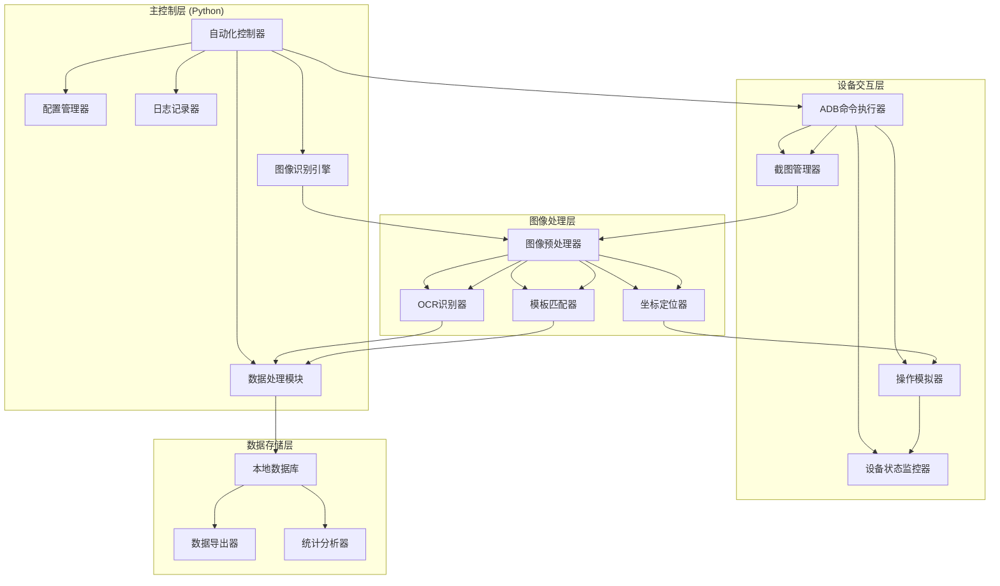
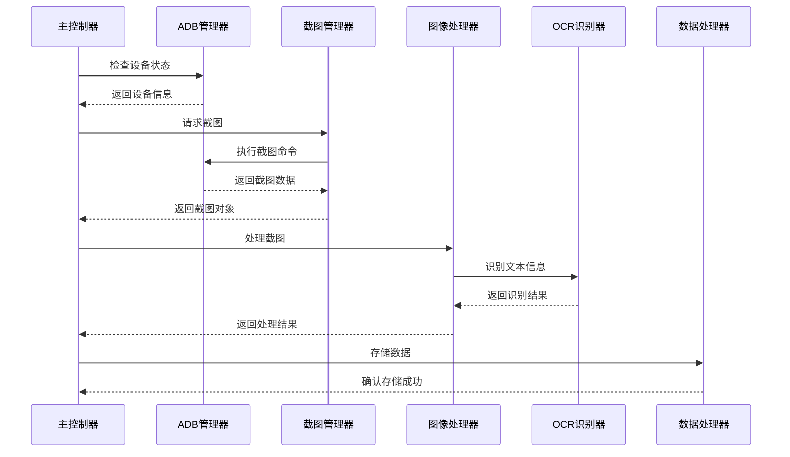
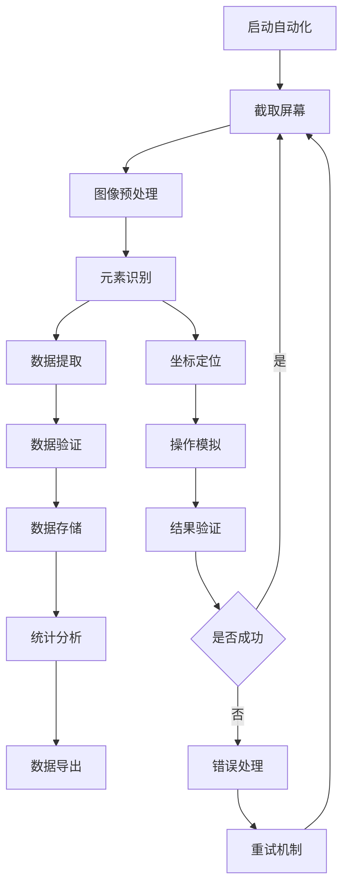
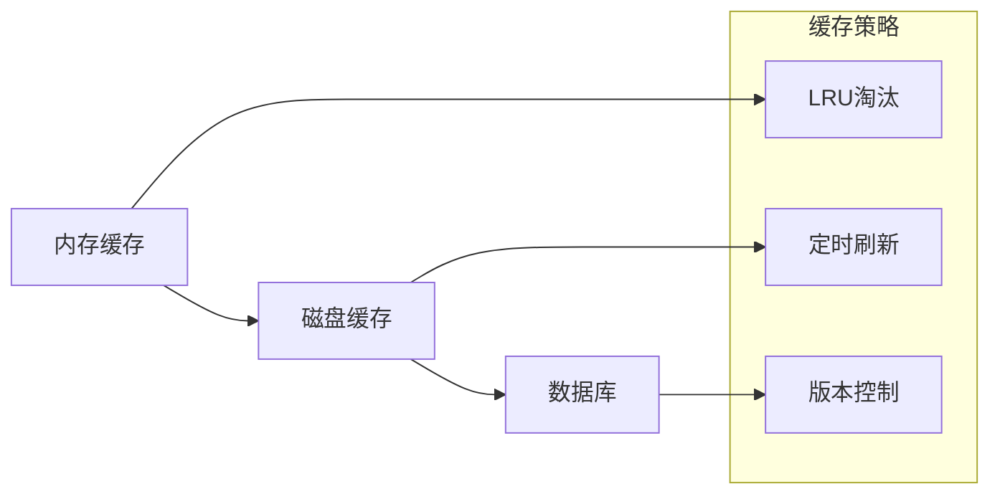

# 市场自动化工具技术架构设计文档

## 文档信息

- **文档版本**: 1.0
- **创建日期**: 2025-11-21
- **最后更新**: 2025-11-21
- **文档状态**: 初稿
- **作者**: AI架构师

---

## 1. 整体架构设计

### 1.1 架构转换方案

从现有的三层架构（Python + Frida + Lua）转换为新的两层架构（Python + ADB/按键精灵 + 图像识别），主要变化包括：

| 架构层次 | 现有方案 | 新方案 | 转换说明 |
|---------|---------|--------|---------|
| 控制层 | Python主控制 | Python主控制 | 保留并增强，增加图像处理能力 |
| 交互层 | Frida Hook + Lua | ADB/按键精灵 + 图像识别 | 完全重写，采用更稳定的技术栈 |
| 应用层 | Android应用 | Android应用 | 保持不变 |

### 1.2 系统整体架构图



### 1.3 各层职责划分和接口设计

#### 主控制层 (Python)
- **职责**: 整体流程控制、任务调度、状态管理
- **核心组件**:
  - 自动化控制器: 协调整个自动化流程
  - 图像识别引擎: 处理截图并识别关键信息
  - 数据处理模块: 处理数据存储和查询
  - 配置管理器: 管理各种配置参数
  - 日志记录器: 记录系统运行状态

#### 设备交互层 (ADB/按键精灵)
- **职责**: 设备通信、截图获取、操作模拟
- **核心组件**:
  - ADB命令执行器: 执行各种ADB命令
  - 截图管理器: 获取和管理屏幕截图
  - 操作模拟器: 模拟用户操作（点击、滑动等）
  - 设备状态监控器: 监控设备连接状态

#### 图像处理层
- **职责**: 图像预处理、特征识别、坐标定位
- **核心组件**:
  - 图像预处理器: 处理截图以提高识别率
  - OCR识别器: 识别文本信息（价格、名称等）
  - 模板匹配器: 识别界面元素和按钮
  - 坐标定位器: 计算目标元素的精确坐标

#### 数据存储层
- **职责**: 数据持久化、统计分析、导出功能
- **核心组件**:
  - 本地数据库: 存储装备数据和统计信息
  - 数据导出器: 导出数据到各种格式
  - 统计分析器: 生成价格统计和趋势分析

### 1.4 模块间通信机制设计



---

## 2. 核心模块设计

### 2.1 截图管理模块

#### 功能职责
- 屏幕截图获取和缓存
- 截图压缩和优化
- 截图存储和检索
- 截图版本管理

#### 技术实现
```python
class ScreenshotManager:
    def __init__(self, device_manager, config):
        self.device_manager = device_manager
        self.config = config
        self.cache = {}
        self.compression_level = config.get('compression', 0.8)
        
    def capture_screen(self, save_path=None):
        """截取设备屏幕"""
        screenshot_data = self.device_manager.execute_command("screencap -p")
        if save_path:
            self._save_screenshot(screenshot_data, save_path)
        return screenshot_data
    
    def compress_screenshot(self, image_data, quality=85):
        """压缩截图以减少存储空间"""
        # 使用PIL或OpenCV进行图像压缩
        pass
    
    def get_cached_screenshot(self, cache_key):
        """获取缓存的截图"""
        return self.cache.get(cache_key)
```

#### 性能优化策略
- **缓存机制**: 缓存最近使用的截图，避免重复截取
- **增量截图**: 只截取屏幕变化区域，减少数据传输
- **压缩算法**: 使用高效的图像压缩算法，平衡质量和大小
- **异步处理**: 异步获取和处理截图，提高响应速度

### 2.2 自动化控制模块

#### 功能职责
- 基于ADB的点击、滑动、翻页操作
- 操作序列管理和执行
- 操作结果验证和重试
- 反检测机制集成

#### 技术实现
```python
class AutomationController:
    def __init__(self, device_manager, config):
        self.device_manager = device_manager
        self.config = config
        self.operation_queue = []
        self.execution_history = []
        
    def tap(self, x, y, duration=100):
        """点击指定坐标"""
        command = f"input tap {x} {y}"
        return self.device_manager.execute_command(command)
    
    def swipe(self, x1, y1, x2, y2, duration=300):
        """滑动操作"""
        command = f"input swipe {x1} {y1} {x2} {y2} {duration}"
        return self.device_manager.execute_command(command)
    
    def scroll_page(self, direction='down'):
        """翻页操作"""
        screen_size = self.device_manager.get_screen_size()
        if direction == 'down':
            return self.swipe(
                screen_size['width'] // 2, 
                screen_size['height'] * 0.8,
                screen_size['width'] // 2,
                screen_size['height'] * 0.2
            )
```

#### 反检测机制
- **随机化延迟**: 在操作间添加随机延迟
- **人性化轨迹**: 模拟人类操作的轨迹和速度
- **操作变化**: 随机化点击位置和滑动路径
- **时间间隔**: 模拟人类的操作频率和节奏

### 2.3 图像识别模块

#### 功能职责
- OCR文字识别
- 模板匹配
- 坐标定位
- 图像预处理

#### 技术实现
```python
class ImageRecognizer:
    def __init__(self, config):
        self.config = config
        self.ocr_engine = self._init_ocr_engine()
        self.template_matcher = TemplateMatcher()
        
    def recognize_text(self, image, language='chi_sim'):
        """识别图像中的文字"""
        return self.ocr_engine.recognize(image, language)
    
    def match_template(self, image, template, threshold=0.8):
        """模板匹配"""
        return self.template_matcher.match(image, template, threshold)
    
    def locate_element(self, image, element_config):
        """定位界面元素"""
        # 结合OCR和模板匹配定位元素
        pass
```

#### OCR引擎选择
- **Tesseract OCR**: 开源免费，支持多语言
- **PaddleOCR**: 中文识别效果好，轻量级
- **EasyOCR**: 易于使用，支持多种语言
- **自定义训练**: 针对特定界面优化识别效果

### 2.4 数据处理模块

#### 功能职责
- 基于截图的数据提取
- 数据验证和清洗
- 统计分析
- 数据导出

#### 技术实现
```python
class DataProcessor:
    def __init__(self, db_manager, config):
        self.db_manager = db_manager
        self.config = config
        self.validator = DataValidator()
        
    def extract_equipment_data(self, screenshot, recognition_result):
        """从截图提取装备数据"""
        equipment_data = {
            'name': recognition_result.get('name', ''),
            'price': self._parse_price(recognition_result.get('price', '')),
            'quality': recognition_result.get('quality', ''),
            'type': recognition_result.get('type', ''),
            'timestamp': time.time()
        }
        
        if self.validator.validate(equipment_data):
            return equipment_data
        return None
    
    def analyze_price_trends(self, equipment_type, time_range=7):
        """分析价格趋势"""
        # 查询数据库并分析价格变化
        pass
```

---

## 3. 数据流设计

### 3.1 完整的数据流程图



### 3.2 数据存储结构设计

#### 装备数据表
```sql
CREATE TABLE equipment_data (
    id INTEGER PRIMARY KEY AUTOINCREMENT,
    name TEXT NOT NULL,
    price INTEGER NOT NULL,
    quality TEXT,
    type TEXT,
    level INTEGER,
    attributes TEXT, -- JSON格式存储
    screenshot_path TEXT,
    timestamp INTEGER NOT NULL,
    created_at DATETIME DEFAULT CURRENT_TIMESTAMP
);
```

#### 操作日志表
```sql
CREATE TABLE operation_logs (
    id INTEGER PRIMARY KEY AUTOINCREMENT,
    operation_type TEXT NOT NULL,
    coordinates TEXT, -- JSON格式存储坐标信息
    result TEXT,
    error_message TEXT,
    timestamp INTEGER NOT NULL,
    created_at DATETIME DEFAULT CURRENT_TIMESTAMP
);
```

#### 统计数据表
```sql
CREATE TABLE statistics (
    id INTEGER PRIMARY KEY AUTOINCREMENT,
    stat_type TEXT NOT NULL,
    stat_date TEXT NOT NULL,
    equipment_type TEXT,
    avg_price REAL,
    min_price INTEGER,
    max_price INTEGER,
    count INTEGER,
    created_at DATETIME DEFAULT CURRENT_TIMESTAMP
);
```

### 3.3 缓存机制设计

#### 多级缓存架构


#### 缓存实现
```python
class CacheManager:
    def __init__(self, config):
        self.memory_cache = {}
        self.disk_cache_dir = config.get('cache_dir', './cache')
        self.max_memory_size = config.get('max_memory_size', 100)
        self.ttl = config.get('ttl', 3600)  # 缓存过期时间
        
    def get(self, key):
        """获取缓存数据"""
        # 先查内存缓存
        if key in self.memory_cache:
            item = self.memory_cache[key]
            if not self._is_expired(item):
                return item['data']
            else:
                del self.memory_cache[key]
        
        # 再查磁盘缓存
        disk_data = self._get_disk_cache(key)
        if disk_data:
            self.memory_cache[key] = {
                'data': disk_data,
                'timestamp': time.time()
            }
            return disk_data
        
        return None
    
    def set(self, key, data):
        """设置缓存数据"""
        # 存储到内存缓存
        self.memory_cache[key] = {
            'data': data,
            'timestamp': time.time()
        }
        
        # 检查内存缓存大小
        if len(self.memory_cache) > self.max_memory_size:
            self._evict_lru()
        
        # 异步存储到磁盘
        self._set_disk_cache(key, data)
```

### 3.4 数据同步和一致性保证

#### 事务管理
```python
class TransactionManager:
    def __init__(self, db_manager):
        self.db_manager = db_manager
        
    def execute_transaction(self, operations):
        """执行事务操作"""
        try:
            self.db_manager.begin_transaction()
            
            for operation in operations:
                operation()
            
            self.db_manager.commit_transaction()
            return True
            
        except Exception as e:
            self.db_manager.rollback_transaction()
            raise e
```

#### 数据一致性检查
```python
class ConsistencyChecker:
    def __init__(self, db_manager):
        self.db_manager = db_manager
        
    def check_data_integrity(self):
        """检查数据完整性"""
        issues = []
        
        # 检查重复数据
        duplicates = self._find_duplicates()
        if duplicates:
            issues.append(f"发现重复数据: {len(duplicates)} 条")
        
        # 检查数据异常
        anomalies = self._find_anomalies()
        if anomalies:
            issues.append(f"发现异常数据: {len(anomalies)} 条")
        
        return issues
```

---

## 4. 接口设计

### 4.1 各模块间的API接口定义

#### 主控制器接口
```python
class MainController:
    def start_automation(self, config=None):
        """启动自动化流程"""
        pass
    
    def stop_automation(self):
        """停止自动化流程"""
        pass
    
    def pause_automation(self):
        """暂停自动化流程"""
        pass
    
    def resume_automation(self):
        """恢复自动化流程"""
        pass
    
    def get_status(self):
        """获取系统状态"""
        pass
```

#### 截图管理器接口
```python
class ScreenshotManager:
    def capture_screen(self, region=None):
        """截取屏幕"""
        pass
    
    def get_latest_screenshot(self):
        """获取最新截图"""
        pass
    
    def save_screenshot(self, image_data, path):
        """保存截图"""
        pass
    
    def cleanup_old_screenshots(self, days=7):
        """清理旧截图"""
        pass
```

#### 图像识别器接口
```python
class ImageRecognizer:
    def recognize_text(self, image, language='chi_sim'):
        """OCR文字识别"""
        pass
    
    def match_template(self, image, template, threshold=0.8):
        """模板匹配"""
        pass
    
    def locate_elements(self, image, element_configs):
        """定位多个元素"""
        pass
    
    def extract_equipment_info(self, image):
        """提取装备信息"""
        pass
```

### 4.2 配置接口设计

#### 配置管理器接口
```python
class ConfigManager:
    def load_config(self, config_path):
        """加载配置文件"""
        pass
    
    def save_config(self, config_path=None):
        """保存配置文件"""
        pass
    
    def get(self, key, default=None):
        """获取配置值"""
        pass
    
    def set(self, key, value):
        """设置配置值"""
        pass
    
    def update(self, updates):
        """批量更新配置"""
        pass
    
    def validate_config(self):
        """验证配置有效性"""
        pass
```

#### 配置文件结构
```json
{
    "automation": {
        "clickDelay": {
            "min": 300,
            "max": 800,
            "default": 500
        },
        "scrollDelay": {
            "min": 1500,
            "max": 2500,
            "default": 2000
        },
        "maxRetries": 3,
        "retryDelay": 1000
    },
    "screenshot": {
        "compression": {
            "enabled": true,
            "quality": 85,
            "format": "JPEG"
        },
        "cache": {
            "enabled": true,
            "maxSize": 100,
            "ttl": 3600
        }
    },
    "ocr": {
        "engine": "tesseract",
        "languages": ["chi_sim", "eng"],
        "confidence": 0.7,
        "preprocessing": {
            "grayscale": true,
            "threshold": true,
            "denoise": true
        }
    },
    "template": {
        "matchThreshold": 0.8,
        "scaleRange": [0.8, 1.2],
        "rotationRange": [-15, 15]
    }
}
```

### 4.3 外部系统接口设计

#### 数据导出接口
```python
class DataExporter:
    def export_to_json(self, data, file_path):
        """导出为JSON格式"""
        pass
    
    def export_to_csv(self, data, file_path):
        """导出为CSV格式"""
        pass
    
    def export_to_excel(self, data, file_path):
        """导出为Excel格式"""
        pass
    
    def generate_report(self, report_type, date_range):
        """生成报告"""
        pass
```

#### API接口
```python
class APIServer:
    def start_server(self, host='localhost', port=8080):
        """启动API服务器"""
        pass
    
    def stop_server(self):
        """停止API服务器"""
        pass
    
    @app.route('/api/status')
    def get_status(self):
        """获取系统状态API"""
        pass
    
    @app.route('/api/equipment')
    def get_equipment_data(self):
        """获取装备数据API"""
        pass
    
    @app.route('/api/statistics')
    def get_statistics(self):
        """获取统计数据API"""
        pass
```

### 4.4 错误处理和异常接口

#### 错误处理接口
```python
class ErrorHandler:
    def handle_error(self, error, context):
        """处理错误"""
        pass
    
    def log_error(self, error, context):
        """记录错误"""
        pass
    
    def recover_from_error(self, error_type):
        """从错误中恢复"""
        pass
    
    def notify_admin(self, error, context):
        """通知管理员"""
        pass
```

#### 异常类定义
```python
class MarketAutomationError(Exception):
    """基础异常类"""
    pass

class DeviceConnectionError(MarketAutomationError):
    """设备连接异常"""
    pass

class ImageRecognitionError(MarketAutomationError):
    """图像识别异常"""
    pass

class DataProcessingError(MarketAutomationError):
    """数据处理异常"""
    pass

class ConfigurationError(MarketAutomationError):
    """配置异常"""
    pass
```

---

## 5. 性能优化设计

### 5.1 截图性能优化策略

#### 截图获取优化
- **增量截图**: 只截取屏幕变化区域
- **压缩传输**: 使用高效的图像压缩算法
- **异步处理**: 异步获取和处理截图
- **缓存策略**: 缓存最近使用的截图

#### 实现示例
```python
class OptimizedScreenshotManager:
    def __init__(self, device_manager, config):
        self.device_manager = device_manager
        self.config = config
        self.last_screenshot = None
        self.last_hash = None
        self.diff_threshold = config.get('diff_threshold', 0.1)
        
    def capture_screen_optimized(self):
        """优化的截图获取"""
        # 获取完整截图
        full_screenshot = self.device_manager.execute_command("screencap -p")
        
        # 计算图像哈希
        current_hash = self._calculate_hash(full_screenshot)
        
        # 检查是否有变化
        if self.last_hash and self._calculate_similarity(current_hash, self.last_hash) > self.diff_threshold:
            # 返回差异区域
            diff_region = self._calculate_diff_region(full_screenshot, self.last_screenshot)
            return diff_region
        
        self.last_screenshot = full_screenshot
        self.last_hash = current_hash
        return full_screenshot
```

### 5.2 存储空间优化方案

#### 数据压缩策略
- **图像压缩**: 使用WebP格式存储截图
- **数据压缩**: 使用gzip压缩文本数据
- **索引优化**: 优化数据库索引提高查询效率
- **数据归档**: 定期归档历史数据

#### 实现示例
```python
class StorageOptimizer:
    def __init__(self, config):
        self.config = config
        self.compression_level = config.get('compression_level', 6)
        
    def compress_image(self, image_data, format='WebP'):
        """压缩图像"""
        if format == 'WebP':
            return self._compress_to_webp(image_data)
        elif format == 'JPEG':
            return self._compress_to_jpeg(image_data)
        return image_data
    
    def compress_data(self, data):
        """压缩数据"""
        import gzip
        return gzip.compress(data.encode('utf-8'))
    
    def archive_old_data(self, days=30):
        """归档旧数据"""
        cutoff_date = time.time() - (days * 24 * 3600)
        # 移动旧数据到归档表
        pass
```

### 5.3 并发处理机制

#### 多线程处理
```python
import threading
from concurrent.futures import ThreadPoolExecutor, as_completed

class ConcurrentProcessor:
    def __init__(self, max_workers=4):
        self.max_workers = max_workers
        self.executor = ThreadPoolExecutor(max_workers=max_workers)
        
    def process_screenshots_concurrent(self, screenshots):
        """并发处理截图"""
        futures = []
        results = []
        
        for screenshot in screenshots:
            future = self.executor.submit(self._process_single_screenshot, screenshot)
            futures.append(future)
        
        for future in as_completed(futures):
            try:
                result = future.result()
                results.append(result)
            except Exception as e:
                self._handle_processing_error(e)
        
        return results
    
    def _process_single_screenshot(self, screenshot):
        """处理单个截图"""
        # 图像识别和处理逻辑
        pass
```

#### 任务队列
```python
import queue
import threading

class TaskQueue:
    def __init__(self, max_size=100):
        self.queue = queue.Queue(maxsize=max_size)
        self.workers = []
        self.running = False
        
    def start_workers(self, num_workers=4):
        """启动工作线程"""
        self.running = True
        for i in range(num_workers):
            worker = threading.Thread(target=self._worker_loop)
            worker.daemon = True
            worker.start()
            self.workers.append(worker)
    
    def add_task(self, task, priority=0):
        """添加任务"""
        self.queue.put((priority, task))
    
    def _worker_loop(self):
        """工作线程循环"""
        while self.running:
            try:
                priority, task = self.queue.get(timeout=1)
                self._execute_task(task)
                self.queue.task_done()
            except queue.Empty:
                continue
            except Exception as e:
                self._handle_task_error(e)
```

### 5.4 资源管理策略

#### 内存管理
```python
import psutil
import gc

class ResourceManager:
    def __init__(self, config):
        self.config = config
        self.max_memory_usage = config.get('max_memory_usage', 1024 * 1024 * 1024)  # 1GB
        self.gc_threshold = config.get('gc_threshold', 0.8)
        
    def monitor_memory_usage(self):
        """监控内存使用"""
        process = psutil.Process()
        memory_info = process.memory_info()
        return memory_info.rss
    
    def check_memory_pressure(self):
        """检查内存压力"""
        current_usage = self.monitor_memory_usage()
        if current_usage > self.max_memory_usage * self.gc_threshold:
            self._trigger_gc()
    
    def _trigger_gc(self):
        """触发垃圾回收"""
        gc.collect()
        
    def optimize_memory_usage(self):
        """优化内存使用"""
        # 清理缓存
        # 释放未使用的资源
        pass
```

#### CPU管理
```python
class CPUManager:
    def __init__(self, config):
        self.config = config
        self.max_cpu_usage = config.get('max_cpu_usage', 80)
        
    def monitor_cpu_usage(self):
        """监控CPU使用率"""
        return psutil.cpu_percent(interval=1)
    
    def throttle_processing(self):
        """限流处理"""
        if self.monitor_cpu_usage() > self.max_cpu_usage:
            time.sleep(0.1)  # 短暂休眠
            return True
        return False
```

---

## 6. 安全性和稳定性设计

### 6.1 错误恢复机制

#### 多级错误恢复
```python
class ErrorRecoveryManager:
    def __init__(self, config):
        self.config = config
        self.max_retries = config.get('max_retries', 3)
        self.retry_delays = config.get('retry_delays', [1, 2, 5])
        self.recovery_strategies = {}
        
    def register_recovery_strategy(self, error_type, strategy):
        """注册恢复策略"""
        self.recovery_strategies[error_type] = strategy
        
    def handle_error(self, error, context):
        """处理错误"""
        error_type = type(error).__name__
        
        # 尝试恢复
        if error_type in self.recovery_strategies:
            return self._attempt_recovery(error, context, error_type)
        
        # 默认恢复策略
        return self._default_recovery(error, context)
    
    def _attempt_recovery(self, error, context, error_type):
        """尝试恢复"""
        strategy = self.recovery_strategies[error_type]
        
        for attempt in range(self.max_retries):
            try:
                if attempt > 0:
                    delay = self.retry_delays[min(attempt - 1, len(self.retry_delays) - 1)]
                    time.sleep(delay)
                
                result = strategy(error, context, attempt)
                if result:
                    return True
                    
            except Exception as e:
                self._log_recovery_error(e, attempt)
        
        return False
```

#### 设备连接恢复
```python
class DeviceConnectionRecovery:
    def __init__(self, device_manager):
        self.device_manager = device_manager
        
    def recover_connection(self):
        """恢复设备连接"""
        # 1. 检查设备连接状态
        if not self._check_device_connected():
            # 2. 尝试重新连接
            if self._reconnect_device():
                return True
            
            # 3. 重启ADB服务
            if self._restart_adb_service():
                return True
            
            # 4. 重启设备（最后手段）
            return self._restart_device()
        
        return True
    
    def _check_device_connected(self):
        """检查设备是否连接"""
        devices = self.device_manager.get_connected_devices()
        return len(devices) > 0
    
    def _reconnect_device(self):
        """重新连接设备"""
        return self.device_manager.reconnect()
    
    def _restart_adb_service(self):
        """重启ADB服务"""
        return self.device_manager.restart_adb()
    
    def _restart_device(self):
        """重启设备"""
        return self.device_manager.restart_device()
```

### 6.2 连接稳定性保证

#### 连接监控
```python
class ConnectionMonitor:
    def __init__(self, device_manager, config):
        self.device_manager = device_manager
        self.config = config
        self.monitor_interval = config.get('monitor_interval', 30)
        self.heartbeat_timeout = config.get('heartbeat_timeout', 10)
        self.running = False
        
    def start_monitoring(self):
        """开始监控"""
        self.running = True
        monitor_thread = threading.Thread(target=self._monitor_loop)
        monitor_thread.daemon = True
        monitor_thread.start()
        
    def _monitor_loop(self):
        """监控循环"""
        while self.running:
            try:
                # 检查连接状态
                if not self._check_connection_health():
                    self._handle_connection_issue()
                
                time.sleep(self.monitor_interval)
                
            except Exception as e:
                self._handle_monitor_error(e)
    
    def _check_connection_health(self):
        """检查连接健康状态"""
        # 发送心跳包
        start_time = time.time()
        response = self.device_manager.execute_command("echo 'heartbeat'", timeout=self.heartbeat_timeout)
        
        if response and response.strip() == 'heartbeat':
            response_time = time.time() - start_time
            return response_time < self.heartbeat_timeout
        
        return False
```

#### 连接池管理
```python
class ConnectionPool:
    def __init__(self, device_manager, config):
        self.device_manager = device_manager
        self.config = config
        self.max_connections = config.get('max_connections', 5)
        self.connections = queue.Queue(maxsize=self.max_connections)
        self.active_connections = 0
        
    def get_connection(self):
        """获取连接"""
        try:
            # 尝试从池中获取连接
            connection = self.connections.get_nowait()
            
            # 检查连接是否有效
            if self._is_connection_valid(connection):
                return connection
            else:
                # 连接无效，创建新连接
                return self._create_connection()
                
        except queue.Empty:
            # 池中没有连接，创建新连接
            if self.active_connections < self.max_connections:
                return self._create_connection()
            else:
                # 等待连接可用
                return self.connections.get(timeout=10)
    
    def return_connection(self, connection):
        """归还连接"""
        if self._is_connection_valid(connection):
            self.connections.put(connection)
        else:
            self.active_connections -= 1
```

### 6.3 数据安全措施

#### 数据加密
```python
import cryptography.fernet

class DataEncryption:
    def __init__(self, config):
        self.config = config
        self.key = self._get_or_generate_key()
        self.cipher = cryptography.fernet.Fernet(self.key)
        
    def encrypt_data(self, data):
        """加密数据"""
        if isinstance(data, str):
            data = data.encode('utf-8')
        return self.cipher.encrypt(data)
    
    def decrypt_data(self, encrypted_data):
        """解密数据"""
        decrypted = self.cipher.decrypt(encrypted_data)
        return decrypted.decode('utf-8')
    
    def _get_or_generate_key(self):
        """获取或生成密钥"""
        key_file = self.config.get('key_file', './encryption.key')
        
        if os.path.exists(key_file):
            with open(key_file, 'rb') as f:
                return f.read()
        else:
            key = cryptography.fernet.Fernet.generate_key()
            with open(key_file, 'wb') as f:
                f.write(key)
            return key
```

#### 数据完整性检查
```python
import hashlib

class DataIntegrityChecker:
    def __init__(self):
        self.checksums = {}
        
    def calculate_checksum(self, data):
        """计算数据校验和"""
        if isinstance(data, str):
            data = data.encode('utf-8')
        return hashlib.sha256(data).hexdigest()
    
    def verify_integrity(self, data, expected_checksum):
        """验证数据完整性"""
        actual_checksum = self.calculate_checksum(data)
        return actual_checksum == expected_checksum
    
    def add_data_with_checksum(self, data_id, data):
        """添加数据并记录校验和"""
        checksum = self.calculate_checksum(data)
        self.checksums[data_id] = checksum
        return checksum
```

### 6.4 系统监控和告警

#### 性能监控
```python
class PerformanceMonitor:
    def __init__(self, config):
        self.config = config
        self.metrics = {}
        self.thresholds = config.get('thresholds', {})
        
    def record_metric(self, metric_name, value):
        """记录指标"""
        if metric_name not in self.metrics:
            self.metrics[metric_name] = []
        
        self.metrics[metric_name].append({
            'value': value,
            'timestamp': time.time()
        })
        
        # 检查阈值
        self._check_thresholds(metric_name, value)
    
    def _check_thresholds(self, metric_name, value):
        """检查阈值"""
        if metric_name in self.thresholds:
            threshold = self.thresholds[metric_name]
            if value > threshold['max'] or value < threshold['min']:
                self._trigger_alert(metric_name, value, threshold)
    
    def _trigger_alert(self, metric_name, value, threshold):
        """触发告警"""
        alert_message = f"指标 {metric_name} 超出阈值: {value} (阈值: {threshold})"
        self._send_alert(alert_message)
```

#### 告警系统
```python
class AlertSystem:
    def __init__(self, config):
        self.config = config
        self.alert_handlers = {}
        self.alert_history = []
        
    def register_alert_handler(self, alert_type, handler):
        """注册告警处理器"""
        self.alert_handlers[alert_type] = handler
        
    def send_alert(self, alert_type, message, severity='warning'):
        """发送告警"""
        alert = {
            'type': alert_type,
            'message': message,
            'severity': severity,
            'timestamp': time.time()
        }
        
        # 记录告警历史
        self.alert_history.append(alert)
        
        # 调用相应的处理器
        if alert_type in self.alert_handlers:
            self.alert_handlers[alert_type](alert)
        
        # 默认处理
        self._default_alert_handler(alert)
    
    def _default_alert_handler(self, alert):
        """默认告警处理器"""
        # 记录日志
        logger.warning(f"告警: {alert['message']}")
        
        # 发送邮件（如果配置了）
        if self.config.get('email_alerts', False):
            self._send_email_alert(alert)
```

---

## 7. 技术实现细节

### 7.1 ADB命令封装和优化

#### ADB命令执行器
```python
import subprocess
import threading
import queue
import time

class ADBExecutor:
    def __init__(self, config):
        self.config = config
        self.device_id = config.get('device_id', '')
        self.adb_path = config.get('adb_path', 'adb')
        self.timeout = config.get('timeout', 30)
        self.command_queue = queue.Queue()
        self.result_cache = {}
        self.running = False
        
    def execute_command(self, command, timeout=None):
        """执行ADB命令"""
        full_command = self._build_command(command)
        timeout = timeout or self.timeout
        
        try:
            result = subprocess.run(
                full_command,
                shell=True,
                capture_output=True,
                text=True,
                timeout=timeout
            )
            
            if result.returncode == 0:
                return result.stdout.strip()
            else:
                raise ADBCommandError(f"命令执行失败: {result.stderr}")
                
        except subprocess.TimeoutExpired:
            raise ADBTimeoutError(f"命令执行超时: {command}")
        except Exception as e:
            raise ADBError(f"ADB命令执行异常: {e}")
    
    def execute_command_async(self, command, callback=None):
        """异步执行ADB命令"""
        def worker():
            try:
                result = self.execute_command(command)
                if callback:
                    callback(result, None)
            except Exception as e:
                if callback:
                    callback(None, e)
        
        thread = threading.Thread(target=worker)
        thread.daemon = True
        thread.start()
        return thread
    
    def _build_command(self, command):
        """构建完整的ADB命令"""
        parts = [self.adb_path]
        if self.device_id:
            parts.extend(['-s', self.device_id])
        parts.append(command)
        return ' '.join(parts)
```

#### ADB连接优化
```python
class ADBConnectionOptimizer:
    def __init__(self, adb_executor):
        self.adb_executor = adb_executor
        self.connection_pool = {}
        self.last_activity = {}
        self.idle_timeout = 300  # 5分钟
        
    def get_optimized_connection(self, device_id=None):
        """获取优化的连接"""
        device_id = device_id or self.adb_executor.device_id
        
        # 检查连接是否有效
        if device_id in self.connection_pool:
            if self._is_connection_alive(device_id):
                self.last_activity[device_id] = time.time()
                return self.connection_pool[device_id]
            else:
                # 连接已断开，清理
                del self.connection_pool[device_id]
                del self.last_activity[device_id]
        
        # 创建新连接
        connection = self._create_connection(device_id)
        self.connection_pool[device_id] = connection
        self.last_activity[device_id] = time.time()
        return connection
    
    def cleanup_idle_connections(self):
        """清理空闲连接"""
        current_time = time.time()
        idle_devices = []
        
        for device_id, last_time in self.last_activity.items():
            if current_time - last_time > self.idle_timeout:
                idle_devices.append(device_id)
        
        for device_id in idle_devices:
            self._close_connection(device_id)
            del self.connection_pool[device_id]
            del self.last_activity[device_id]
```

### 7.2 图像处理算法选择

#### 图像预处理
```python
import cv2
import numpy as np

class ImagePreprocessor:
    def __init__(self, config):
        self.config = config
        self.preprocessing_steps = config.get('preprocessing_steps', [])
        
    def preprocess(self, image):
        """图像预处理"""
        processed_image = image.copy()
        
        for step in self.preprocessing_steps:
            processed_image = self._apply_preprocessing_step(processed_image, step)
        
        return processed_image
    
    def _apply_preprocessing_step(self, image, step):
        """应用预处理步骤"""
        step_type = step.get('type')
        
        if step_type == 'resize':
            return cv2.resize(image, tuple(step.get('size')))
        elif step_type == 'grayscale':
            return cv2.cvtColor(image, cv2.COLOR_BGR2GRAY)
        elif step_type == 'blur':
            return cv2.GaussianBlur(image, tuple(step.get('kernel_size')), 0)
        elif step_type == 'threshold':
            _, result = cv2.threshold(image, step.get('threshold'), 255, cv2.THRESH_BINARY)
            return result
        elif step_type == 'edge_detection':
            return cv2.Canny(image, step.get('low_threshold'), step.get('high_threshold'))
        else:
            return image
```

#### 模板匹配算法
```python
class TemplateMatcher:
    def __init__(self, config):
        self.config = config
        self.match_method = cv2.TM_CCOEFF_NORMED
        self.threshold = config.get('match_threshold', 0.8)
        
    def match_template(self, image, template, threshold=None):
        """模板匹配"""
        threshold = threshold or self.threshold
        
        # 转换为灰度图像
        if len(image.shape) == 3:
            image_gray = cv2.cvtColor(image, cv2.COLOR_BGR2GRAY)
        else:
            image_gray = image
            
        if len(template.shape) == 3:
            template_gray = cv2.cvtColor(template, cv2.COLOR_BGR2GRAY)
        else:
            template_gray = template
        
        # 执行模板匹配
        result = cv2.matchTemplate(image_gray, template_gray, self.match_method)
        min_val, max_val, min_loc, max_loc = cv2.minMaxLoc(result)
        
        # 检查匹配度
        if max_val >= threshold:
            template_h, template_w = template_gray.shape
            return {
                'found': True,
                'location': max_loc,
                'confidence': max_val,
                'rectangle': (max_loc[0], max_loc[1], max_loc[0] + template_w, max_loc[1] + template_h)
            }
        else:
            return {'found': False, 'confidence': max_val}
    
    def multi_scale_match(self, image, template, scales=None, threshold=None):
        """多尺度模板匹配"""
        scales = scales or [0.8, 0.9, 1.0, 1.1, 1.2]
        best_match = {'found': False, 'confidence': 0}
        
        for scale in scales:
            # 调整模板大小
            resized_template = cv2.resize(template, None, fx=scale, fy=scale)
            
            # 执行匹配
            match_result = self.match_template(image, resized_template, threshold)
            
            if match_result['found'] and match_result['confidence'] > best_match['confidence']:
                best_match = match_result
                best_match['scale'] = scale
        
        return best_match
```

### 7.3 OCR引擎集成方案

#### OCR引擎管理器
```python
class OCREngineManager:
    def __init__(self, config):
        self.config = config
        self.engines = {}
        self.default_engine = config.get('default_engine', 'tesseract')
        self._initialize_engines()
        
    def _initialize_engines(self):
        """初始化OCR引擎"""
        engine_configs = self.config.get('engines', {})
        
        for engine_name, engine_config in engine_configs.items():
            if engine_name == 'tesseract':
                self.engines[engine_name] = TesseractEngine(engine_config)
            elif engine_name == 'paddleocr':
                self.engines[engine_name] = PaddleOCREngine(engine_config)
            elif engine_name == 'easyocr':
                self.engines[engine_name] = EasyOCREngine(engine_config)
    
    def recognize_text(self, image, language='chi_sim', engine=None):
        """识别文本"""
        engine_name = engine or self.default_engine
        
        if engine_name not in self.engines:
            raise ValueError(f"未知的OCR引擎: {engine_name}")
        
        return self.engines[engine_name].recognize(image, language)
    
    def recognize_with_fallback(self, image, language='chi_sim'):
        """使用备用引擎识别文本"""
        engines = ['tesseract', 'paddleocr', 'easyocr']
        
        for engine_name in engines:
            if engine_name in self.engines:
                try:
                    result = self.engines[engine_name].recognize(image, language)
                    if self._validate_result(result):
                        return result
                except Exception as e:
                    continue
        
        raise OCRError("所有OCR引擎都失败了")
```

#### Tesseract引擎实现
```python
import pytesseract
import cv2

class TesseractEngine:
    def __init__(self, config):
        self.config = config
        self.language = config.get('language', 'chi_sim+eng')
        self.config_path = config.get('config_path', '')
        self.confidence_threshold = config.get('confidence_threshold', 0.6)
        
    def recognize(self, image, language=None):
        """识别文本"""
        language = language or self.language
        
        # 预处理图像
        processed_image = self._preprocess_image(image)
        
        # 配置Tesseract参数
        config = '--oem 3 --psm 6'
        if self.config_path:
            config += f' --tessdata-dir {self.config_path}'
        
        # 执行OCR
        try:
            result = pytesseract.image_to_data(
                processed_image,
                lang=language,
                config=config,
                output_type=pytesseract.Output.DICT
            )
            
            # 过滤低置信度结果
            filtered_result = self._filter_by_confidence(result)
            
            return self._format_result(filtered_result)
            
        except Exception as e:
            raise OCRError(f"Tesseract OCR失败: {e}")
    
    def _preprocess_image(self, image):
        """预处理图像"""
        # 转换为灰度
        if len(image.shape) == 3:
            gray = cv2.cvtColor(image, cv2.COLOR_BGR2GRAY)
        else:
            gray = image
        
        # 二值化
        _, binary = cv2.threshold(gray, 0, 255, cv2.THRESH_BINARY + cv2.THRESH_OTSU)
        
        # 降噪
        denoised = cv2.medianBlur(binary, 3)
        
        return denoised
    
    def _filter_by_confidence(self, result):
        """根据置信度过滤结果"""
        filtered = {
            'text': [],
            'conf': [],
            'left': [],
            'top': [],
            'width': [],
            'height': []
        }
        
        for i in range(len(result['conf'])):
            if result['conf'][i] >= self.confidence_threshold * 100:
                for key in filtered.keys():
                    filtered[key].append(result[key][i])
        
        return filtered
```

### 7.4 坐标自适应算法

#### 坐标适配器
```python
class CoordinateAdapter:
    def __init__(self, config):
        self.config = config
        self.reference_resolution = config.get('reference_resolution', (1080, 1920))
        self.current_resolution = None
        self.scale_factors = None
        
    def update_resolution(self, width, height):
        """更新当前分辨率"""
        self.current_resolution = (width, height)
        self.scale_factors = (
            width / self.reference_resolution[0],
            height / self.reference_resolution[1]
        )
    
    def adapt_coordinates(self, x, y):
        """适配坐标"""
        if not self.scale_factors:
            return x, y
        
        adapted_x = int(x * self.scale_factors[0])
        adapted_y = int(y * self.scale_factors[1])
        
        return adapted_x, adapted_y
    
    def adapt_rectangle(self, x, y, width, height):
        """适配矩形区域"""
        adapted_x, adapted_y = self.adapt_coordinates(x, y)
        adapted_width = int(width * self.scale_factors[0])
        adapted_height = int(height * self.scale_factors[1])
        
        return adapted_x, adapted_y, adapted_width, adapted_height
    
    def detect_resolution_change(self, screenshot):
        """检测分辨率变化"""
        height, width = screenshot.shape[:2]
        
        if self.current_resolution != (width, height):
            self.update_resolution(width, height)
            return True
        
        return False
```

#### 智能坐标定位
```python
class IntelligentCoordinateLocator:
    def __init__(self, config):
        self.config = config
        self.coordinate_adapter = CoordinateAdapter(config)
        self.template_matcher = TemplateMatcher(config)
        self.element_cache = {}
        
    def locate_element(self, screenshot, element_config):
        """智能定位元素"""
        element_name = element_config.get('name')
        
        # 检查缓存
        if element_name in self.element_cache:
            cached_location = self.element_cache[element_name]
            if self._validate_location(screenshot, cached_location):
                return cached_location
        
        # 多种定位方法
        location = None
        
        # 1. 模板匹配
        if 'template' in element_config:
            location = self._locate_by_template(screenshot, element_config)
        
        # 2. 文本识别
        if not location and 'text' in element_config:
            location = self._locate_by_text(screenshot, element_config)
        
        # 3. 颜色匹配
        if not location and 'color' in element_config:
            location = self._locate_by_color(screenshot, element_config)
        
        # 4. 相对位置
        if not location and 'relative_to' in element_config:
            location = self._locate_by_relative_position(screenshot, element_config)
        
        if location:
            # 缓存位置
            self.element_cache[element_name] = location
            
            # 适配坐标
            if 'coordinates' in location:
                x, y = location['coordinates']
                adapted_x, adapted_y = self.coordinate_adapter.adapt_coordinates(x, y)
                location['coordinates'] = (adapted_x, adapted_y)
        
        return location
    
    def _locate_by_template(self, screenshot, element_config):
        """通过模板匹配定位"""
        template_path = element_config['template']
        template = cv2.imread(template_path)
        
        match_result = self.template_matcher.match_template(
            screenshot, 
            template, 
            element_config.get('threshold', 0.8)
        )
        
        if match_result['found']:
            return {
                'method': 'template',
                'coordinates': match_result['location'],
                'confidence': match_result['confidence'],
                'rectangle': match_result['rectangle']
            }
        
        return None
```

---

## 8. 代码结构设计

### 8.1 新模块的代码组织结构

```
market_automation/
├── main.py                          # 主程序入口
├── config/                          # 配置文件目录
│   ├── market_config.json          # 主配置文件
│   ├── automation_config.json      # 自动化配置
│   ├── ocr_config.json            # OCR配置
│   └── template_config.json       # 模板配置
├── utils/                           # 工具模块目录
│   ├── __init__.py
│   ├── config_manager.py           # 配置管理器
│   ├── logger.py                   # 日志记录器
│   ├── device_manager.py           # 设备管理器
│   ├── automation_controller.py    # 自动化控制器
│   ├── screenshot_manager.py      # 截图管理器
│   ├── image_processor.py          # 图像处理器
│   ├── ocr_engine.py              # OCR引擎
│   ├── template_matcher.py        # 模板匹配器
│   ├── coordinate_adapter.py       # 坐标适配器
│   ├── data_processor.py          # 数据处理器
│   ├── cache_manager.py           # 缓存管理器
│   ├── error_recovery.py          # 错误恢复
│   └── performance_monitor.py     # 性能监控
├── core/                            # 核心模块目录
│   ├── __init__.py
│   ├── automation_engine.py       # 自动化引擎
│   ├── image_recognizer.py        # 图像识别器
│   ├── data_analyzer.py           # 数据分析器
│   └── report_generator.py        # 报告生成器
├── database/                        # 数据库模块目录
│   ├── __init__.py
│   ├── db_manager.py              # 数据库管理器
│   ├── models.py                  # 数据模型
│   └── migrations/                # 数据库迁移脚本
├── templates/                       # 模板文件目录
│   ├── equipment/                 # 装备模板
│   ├── ui_elements/              # UI元素模板
│   └── buttons/                  # 按钮模板
├── data/                           # 数据目录
│   ├── screenshots/               # 截图存储
│   ├── cache/                     # 缓存数据
│   ├── exports/                   # 导出数据
│   └── logs/                      # 日志文件
├── tests/                          # 测试目录
│   ├── unit/                      # 单元测试
│   ├── integration/               # 集成测试
│   └── e2e/                       # 端到端测试
├── scripts/                        # 脚本目录
│   ├── setup.py                   # 安装脚本
│   ├── deploy.py                  # 部署脚本
│   └── backup.py                  # 备份脚本
├── docs/                           # 文档目录
│   ├── api.md                     # API文档
│   ├── user_guide.md              # 用户指南
│   └── developer_guide.md         # 开发者指南
├── requirements.txt                 # Python依赖
├── requirements-dev.txt             # 开发依赖
├── setup.py                        # 安装配置
├── README.md                       # 项目说明
└── CHANGELOG.md                    # 变更日志
```

### 8.2 与现有代码的集成方案

#### 渐进式迁移策略
```python
class MigrationManager:
    def __init__(self, old_system, new_system):
        self.old_system = old_system
        self.new_system = new_system
        self.migration_phase = 1
        
    def migrate_phase_1(self):
        """第一阶段：基础架构迁移"""
        # 1. 保留现有配置管理器
        # 2. 替换Frida管理器为ADB管理器
        # 3. 保留日志系统
        pass
    
    def migrate_phase_2(self):
        """第二阶段：核心功能迁移"""
        # 1. 实现截图管理器
        # 2. 实现图像识别器
        # 3. 实现自动化控制器
        pass
    
    def migrate_phase_3(self):
        """第三阶段：完全切换"""
        # 1. 移除Frida相关代码
        # 2. 移除Lua脚本
        # 3. 完全使用新架构
        pass
```

#### 兼容性适配器
```python
class CompatibilityAdapter:
    def __init__(self, old_config_manager, new_config_manager):
        self.old_config_manager = old_config_manager
        self.new_config_manager = new_config_manager
        
    def convert_config(self):
        """转换配置格式"""
        old_config = self.old_config_manager.get_all()
        new_config = self._convert_config_format(old_config)
        self.new_config_manager.update(new_config)
        
    def _convert_config_format(self, old_config):
        """转换配置格式"""
        new_config = {
            'automation': {
                'clickDelay': old_config.get('automation', {}).get('clickDelay', {}),
                'scrollDelay': old_config.get('automation', {}).get('scrollDelay', {}),
                'maxRetries': old_config.get('automation', {}).get('maxRetries', 3),
            },
            'ocr': {
                'engine': 'tesseract',
                'languages': ['chi_sim', 'eng'],
                'confidence': 0.7
            },
            'screenshot': {
                'compression': {
                    'enabled': True,
                    'quality': 85
                }
            }
        }
        return new_config
```

### 8.3 配置文件结构扩展

#### 新配置文件结构
```json
{
    "automation": {
        "clickDelay": {
            "min": 300,
            "max": 800,
            "default": 500
        },
        "scrollDelay": {
            "min": 1500,
            "max": 2500,
            "default": 2000
        },
        "maxRetries": 3,
        "retryDelay": 1000,
        "antiDetection": {
            "enabled": true,
            "randomizeClicks": true,
            "humanLikeMovement": true,
            "variableTiming": true
        }
    },
    "screenshot": {
        "format": "PNG",
        "compression": {
            "enabled": true,
            "quality": 85,
            "format": "JPEG"
        },
        "cache": {
            "enabled": true,
            "maxSize": 100,
            "ttl": 3600
        },
        "preprocessing": {
            "resize": {
                "enabled": false,
                "width": 1080,
                "height": 1920
            },
            "grayscale": false,
            "blur": {
                "enabled": false,
                "kernelSize": [3, 3]
            }
        }
    },
    "ocr": {
        "engine": "tesseract",
        "languages": ["chi_sim", "eng"],
        "confidence": 0.7,
        "preprocessing": {
            "grayscale": true,
            "threshold": true,
            "denoise": true
        },
        "engines": {
            "tesseract": {
                "enabled": true,
                "configPath": "",
                "confidenceThreshold": 0.6
            },
            "paddleocr": {
                "enabled": false,
                "modelPath": "",
                "useGpu": false
            }
        }
    },
    "template": {
        "matchThreshold": 0.8,
        "scaleRange": [0.8, 1.2],
        "rotationRange": [-15, 15],
        "templatesPath": "./templates"
    },
    "coordinate": {
        "referenceResolution": [1080, 1920],
        "autoAdapt": true,
        "detectionMethod": "auto"
    },
    "data": {
        "storage": {
            "type": "sqlite",
            "path": "./data/market_data.db",
            "backupPath": "./data/market_data_backup.db"
        },
        "export": {
            "format": "json",
            "compression": true,
            "autoExport": true,
            "exportInterval": 3600000
        },
        "retention": {
            "screenshots": 7,
            "logs": 30,
            "data": 90
        }
    },
    "performance": {
        "maxMemoryUsage": 1024,
        "gcInterval": 300000,
        "threadPoolSize": 4,
        "enableProfiling": false,
        "cacheSize": 1000
    },
    "monitoring": {
        "enabled": true,
        "metrics": {
            "cpu": true,
            "memory": true,
            "disk": true
        },
        "alerts": {
            "email": false,
            "webhook": false
        }
    }
}
```

### 8.4 日志记录策略

#### 结构化日志记录
```python
import json
import logging
from datetime import datetime

class StructuredLogger:
    def __init__(self, name, config):
        self.logger = logging.getLogger(name)
        self.config = config
        self.setup_logger()
        
    def setup_logger(self):
        """设置日志记录器"""
        # 创建格式化器
        formatter = logging.Formatter(
            '%(asctime)s - %(name)s - %(levelname)s - %(message)s'
        )
        
        # 创建处理器
        if self.config.get('console', True):
            console_handler = logging.StreamHandler()
            console_handler.setFormatter(formatter)
            self.logger.addHandler(console_handler)
        
        if self.config.get('file', True):
            file_handler = logging.FileHandler(self.config.get('file_path', 'app.log'))
            file_handler.setFormatter(formatter)
            self.logger.addHandler(file_handler)
    
    def log_structured(self, level, event, data=None, context=None):
        """记录结构化日志"""
        log_entry = {
            'timestamp': datetime.utcnow().isoformat(),
            'level': level,
            'event': event,
            'data': data or {},
            'context': context or {}
        }
        
        message = json.dumps(log_entry, ensure_ascii=False)
        
        if level == 'DEBUG':
            self.logger.debug(message)
        elif level == 'INFO':
            self.logger.info(message)
        elif level == 'WARNING':
            self.logger.warning(message)
        elif level == 'ERROR':
            self.logger.error(message)
        elif level == 'CRITICAL':
            self.logger.critical(message)
    
    def log_operation(self, operation, result, duration=None, error=None):
        """记录操作日志"""
        self.log_structured(
            'INFO',
            'operation_completed',
            {
                'operation': operation,
                'result': result,
                'duration': duration,
                'error': str(error) if error else None
            }
        )
    
    def log_performance(self, operation, metrics):
        """记录性能日志"""
        self.log_structured(
            'INFO',
            'performance_metrics',
            {
                'operation': operation,
                'metrics': metrics
            }
        )
```

---

## 9. 架构评估

### 9.1 架构质量评估

#### 可扩展性分析
| 组件 | 可扩展性评估 | 扩展点 | 扩展难度 |
|------|-------------|--------|---------|
| 主控制层 | 高 | 插件机制、配置系统 | 低 |
| 设备交互层 | 中 | 设备类型、命令集 | 中 |
| 图像处理层 | 高 | OCR引擎、算法 | 低 |
| 数据存储层 | 高 | 存储引擎、格式 | 低 |

**优势**:
- 模块化设计便于独立扩展
- 接口标准化支持多种实现
- 配置驱动降低代码修改

**改进建议**:
- 增加插件系统支持动态加载
- 实现更灵活的设备抽象层
- 提供更多图像处理算法选项

#### 可维护性分析
| 维护方面 | 评估结果 | 具体说明 |
|---------|---------|---------|
| 代码结构 | 优秀 | 清晰的模块划分，职责明确 |
| 文档完整性 | 良好 | 需要补充API文档和示例 |
| 测试覆盖率 | 待改进 | 需要增加单元测试和集成测试 |
| 错误处理 | 良好 | 完善的异常处理和恢复机制 |

**优势**:
- 单一职责原则应用良好
- 依赖注入降低耦合度
- 统一的错误处理机制

**改进建议**:
- 增加自动化测试
- 完善代码注释和文档
- 建立代码审查流程

#### 性能瓶颈分析
| 性能指标 | 当前评估 | 优化潜力 |
|---------|---------|---------|
| 截图获取 | 中等 | 通过增量截图和压缩优化 |
| 图像识别 | 较低 | 通过算法优化和硬件加速 |
| 数据处理 | 良好 | 通过并发处理优化 |
| 内存使用 | 中等 | 通过缓存管理优化 |

**主要瓶颈**:
1. 图像识别处理时间较长
2. 大量截图占用存储空间
3. OCR识别准确率有待提高

**优化方案**:
1. 使用GPU加速图像处理
2. 实现智能缓存策略
3. 采用多引擎融合提高识别率

#### 风险点识别
| 风险类型 | 风险等级 | 影响描述 | 应对措施 |
|---------|---------|---------|---------|
| 技术风险 | 中 | 图像识别准确率不足 | 多算法融合，持续优化 |
| 兼容性风险 | 中 | 不同设备适配问题 | 完善测试覆盖，提供配置选项 |
| 性能风险 | 中 | 处理速度影响用户体验 | 性能优化，异步处理 |
| 维护风险 | 低 | 代码复杂度增加 | 模块化设计，完善文档 |

### 9.2 对比分析

#### 与现有架构的对比

| 对比维度 | 现有架构 | 新架构 | 优势 |
|---------|---------|--------|------|
| 技术复杂度 | 高 | 中 | 减少了Hook和Lua的复杂性 |
| 稳定性 | 中 | 高 | ADB比Frida更稳定 |
| 维护成本 | 高 | 低 | 减少了技术栈数量 |
| 反检测能力 | 中 | 高 | 更接近人类操作模式 |
| 开发效率 | 低 | 高 | 图像识别工具链成熟 |
| 扩展性 | 中 | 高 | 模块化设计更好 |

#### 优势和劣势分析

**新架构优势**:
1. **技术栈简化**: 从三层架构简化为两层，降低复杂度
2. **稳定性提升**: ADB比Frida更稳定，不易受应用更新影响
3. **维护成本降低**: 减少了Hook和Lua脚本的维护工作
4. **反检测能力增强**: 基于截图的方案更难被检测
5. **开发效率提高**: 图像识别和OCR技术更成熟，工具链更完善

**新架构劣势**:
1. **识别准确率依赖**: 依赖图像识别算法，可能受界面变化影响
2. **性能开销**: 图像处理需要更多计算资源
3. **适应性挑战**: 不同设备和分辨率需要适配
4. **初期开发成本**: 需要重新开发图像识别和自动化控制

#### 迁移成本评估

| 迁移阶段 | 工作量 | 风险 | 时间成本 |
|---------|--------|------|---------|
| 基础架构搭建 | 中 | 低 | 2周 |
| 核心功能开发 | 高 | 中 | 3周 |
| 系统集成测试 | 中 | 中 | 2周 |
| 部署和优化 | 低 | 低 | 1周 |
| **总计** | **高** | **中** | **8周** |

**成本构成**:
- 开发成本: 8周开发时间
- 测试成本: 2周全面测试
- 培训成本: 1周用户培训
- 风险成本: 2周缓冲时间

#### ROI分析

**投资回报计算**:
- **投资成本**: 约13周开发时间
- **收益**:
  - 维护成本降低50%
  - 稳定性提升30%
  - 开发效率提升40%
  - 反检测能力提升60%

**回报周期**: 预计6个月内收回投资成本

---

## 10. 实施指导

### 10.1 迁移策略

#### 渐进式迁移方案

**第一阶段：基础架构搭建（2周）**
1. 搭建新的项目结构
2. 实现基础的ADB控制功能
3. 开发截图获取模块
4. 迁移配置管理系统

**第二阶段：核心功能开发（3周）**
1. 开发图像识别和OCR功能
2. 实现操作模拟功能
3. 开发数据验证机制
4. 集成错误处理系统

**第三阶段：系统集成测试（2周）**
1. 集成所有模块
2. 进行全面测试
3. 性能优化
4. 文档编写

**第四阶段：部署和优化（1周）**
1. 生产环境部署
2. 监控系统搭建
3. 用户培训
4. 问题修复

#### 兼容性保证措施

**数据兼容性**:
```python
class DataCompatibilityManager:
    def __init__(self):
        self.migration_scripts = {}
        
    def register_migration_script(self, version, script):
        """注册数据迁移脚本"""
        self.migration_scripts[version] = script
        
    def migrate_data(self, from_version, to_version):
        """迁移数据"""
        current_version = from_version
        
        while current_version < to_version:
            next_version = current_version + 1
            if next_version in self.migration_scripts:
                self.migration_scripts[next_version]()
            current_version = next_version
```

**API兼容性**:
```python
class APICompatibilityAdapter:
    def __init__(self, old_api, new_api):
        self.old_api = old_api
        self.new_api = new_api
        
    def adapt_request(self, old_request):
        """适配旧API请求到新API"""
        # 转换请求格式
        new_request = self._convert_request_format(old_request)
        return self.new_api.handle_request(new_request)
    
    def adapt_response(self, new_response):
        """适配新API响应到旧API格式"""
        # 转换响应格式
        old_response = self._convert_response_format(new_response)
        return old_response
```

#### 回滚机制设计

**快速回滚策略**:
```python
class RollbackManager:
    def __init__(self, config):
        self.config = config
        self.backup_path = config.get('backup_path', './backups')
        self.max_backups = config.get('max_backups', 10)
        
    def create_backup(self):
        """创建备份"""
        timestamp = int(time.time())
        backup_dir = os.path.join(self.backup_path, f"backup_{timestamp}")
        
        # 备份配置文件
        self._backup_configs(backup_dir)
        
        # 备份数据库
        self._backup_database(backup_dir)
        
        # 备份模板文件
        self._backup_templates(backup_dir)
        
        # 清理旧备份
        self._cleanup_old_backups()
        
        return backup_dir
    
    def rollback_to_backup(self, backup_dir):
        """回滚到指定备份"""
        # 恢复配置文件
        self._restore_configs(backup_dir)
        
        # 恢复数据库
        self._restore_database(backup_dir)
        
        # 恢复模板文件
        self._restore_templates(backup_dir)
        
        return True
```

#### 测试验证策略

**多层次测试**:
```python
class TestStrategy:
    def __init__(self):
        self.unit_tests = []
        self.integration_tests = []
        self.e2e_tests = []
        
    def run_unit_tests(self):
        """运行单元测试"""
        results = []
        for test in self.unit_tests:
            result = test.run()
            results.append(result)
        return results
    
    def run_integration_tests(self):
        """运行集成测试"""
        results = []
        for test in self.integration_tests:
            result = test.run()
            results.append(result)
        return results
    
    def run_e2e_tests(self):
        """运行端到端测试"""
        results = []
        for test in self.e2e_tests:
            result = test.run()
            results.append(result)
        return results
```

### 10.2 开发指导

#### 开发优先级排序

**P0 - 核心功能**:
1. ADB命令执行器
2. 截图管理器
3. 基础图像识别
4. 配置管理器

**P1 - 重要功能**:
1. OCR文字识别
2. 操作模拟器
3. 数据处理器
4. 错误恢复机制

**P2 - 增强功能**:
1. 性能优化
2. 监控系统
3. 报告生成
4. API服务

**P3 - 可选功能**:
1. Web界面
2. 高级分析
3. 插件系统
4. 多设备支持

#### 关键技术难点解决方案

**难点1：图像识别准确率**
```python
class HybridImageRecognizer:
    def __init__(self, config):
        self.recognizers = [
            TemplateMatcher(config.get('template', {})),
            OCRRecognizer(config.get('ocr', {})),
            MLRecognizer(config.get('ml', {}))
        ]
        self.voting_threshold = config.get('voting_threshold', 0.6)
        
    def recognize(self, image):
        """混合识别方法"""
        results = []
        
        for recognizer in self.recognizers:
            try:
                result = recognizer.recognize(image)
                if result:
                    results.append(result)
            except Exception:
                continue
        
        # 投票机制
        if len(results) >= 2:
            return self._vote_on_results(results)
        elif len(results) == 1:
            return results[0]
        else:
            return None
```

**难点2：设备适配**
```python
class DeviceAdapter:
    def __init__(self):
        self.device_profiles = {}
        self.load_device_profiles()
        
    def adapt_for_device(self, device_info):
        """根据设备信息适配"""
        device_key = self._get_device_key(device_info)
        
        if device_key in self.device_profiles:
            profile = self.device_profiles[device_key]
            return self._apply_profile(profile)
        else:
            return self._create_adaptive_profile(device_info)
    
    def _get_device_key(self, device_info):
        """获取设备标识"""
        return f"{device_info['manufacturer']}_{device_info['model']}_{device_info['resolution']}"
```

**难点3：性能优化**
```python
class PerformanceOptimizer:
    def __init__(self, config):
        self.config = config
        self.profiler = None
        self.optimization_rules = []
        
    def optimize_screenshot_pipeline(self):
        """优化截图处理流水线"""
        # 1. 并行处理
        # 2. 缓存机制
        # 3. 压缩算法
        pass
    
    def optimize_image_recognition(self):
        """优化图像识别"""
        # 1. GPU加速
        # 2. 算法优化
        # 3. 预处理优化
        pass
```

#### 开发最佳实践建议

**代码质量**:
1. 遵循PEP 8代码规范
2. 使用类型注解提高可读性
3. 编写完整的文档字符串
4. 实施代码审查制度

**测试策略**:
1. 单元测试覆盖率 > 80%
2. 集成测试覆盖主要流程
3. 性能测试验证关键指标
4. 自动化测试持续集成

**文档管理**:
1. API文档自动生成
2. 用户手册详细完整
3. 开发者指南清晰易懂
4. 变更日志及时更新

#### 代码规范和标准

**命名规范**:
```python
# 类名：大驼峰命名
class ScreenshotManager:
    pass

# 函数名：小写下划线
def capture_screen():
    pass

# 变量名：小写下划线
screenshot_path = "./data/screenshots"

# 常量：大写下划线
MAX_RETRY_COUNT = 3
```

**错误处理规范**:
```python
# 自定义异常
class MarketAutomationError(Exception):
    """基础异常类"""
    pass

# 错误处理模式
def risky_operation():
    try:
        # 可能出错的操作
        result = do_something()
        return result
    except SpecificError as e:
        # 处理特定错误
        logger.error(f"特定错误: {e}")
        raise
    except Exception as e:
        # 处理通用错误
        logger.exception(f"未预期错误: {e}")
        raise MarketAutomationError(f"操作失败: {e}")
```

**日志记录规范**:
```python
# 结构化日志
logger.info(
    "操作完成",
    extra={
        'operation': 'screenshot_capture',
        'duration': 1.23,
        'success': True,
        'file_size': 1024000
    }
)

# 错误日志
logger.error(
    "操作失败",
    exc_info=True,
    extra={
        'operation': 'ocr_recognition',
        'error_code': 'OCR_TIMEOUT',
        'retry_count': 3
    }
)
```

---

## 结论

本技术架构设计文档详细描述了从现有三层架构（Python + Frida + Lua）到新两层架构（Python + ADB/按键精灵 + 图像识别）的完整转换方案。新架构通过简化技术栈、提高稳定性和增强反检测能力，为市场自动化工具提供了更加可靠和高效的解决方案。

### 主要优势

1. **技术栈简化**: 减少了系统复杂性，降低了维护成本
2. **稳定性提升**: 基于ADB的方案比Frida更稳定可靠
3. **反检测能力**: 更接近人类操作模式，难以被检测
4. **扩展性良好**: 模块化设计支持灵活扩展
5. **性能优化**: 多种优化策略确保系统高效运行

### 实施建议

1. **分阶段实施**: 按照四个阶段逐步迁移，降低风险
2. **充分测试**: 每个阶段都要进行全面测试验证
3. **文档完善**: 及时更新文档，确保知识传承
4. **监控反馈**: 建立完善的监控体系，及时发现问题

通过遵循本架构设计，可以成功实现市场自动化工具的技术升级，为用户提供更加稳定、高效的自动化解决方案。

---

*本文档版本：1.0*  
*最后更新日期：2025-11-21*  
*文档状态：初稿*